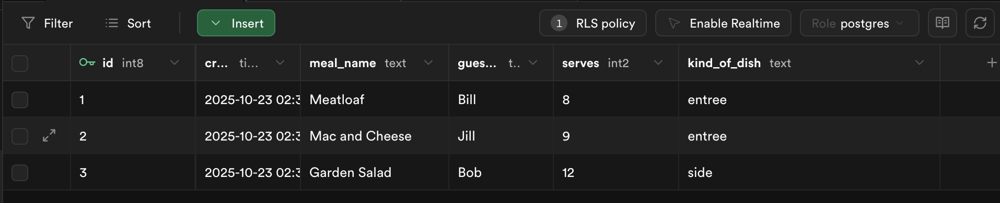
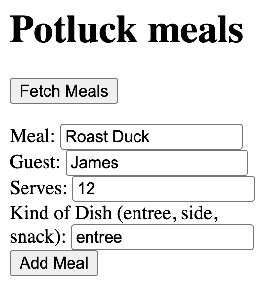
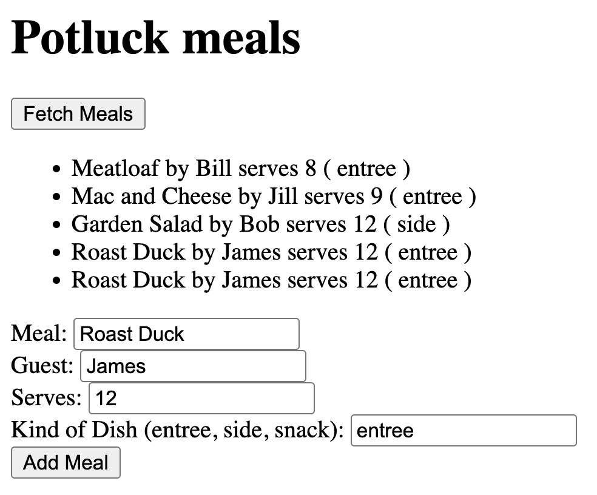

# React + Supabase Potluck App - Student Learning Guide

This comprehensive guide will walk you through building a React application with Supabase database integration. You'll create a potluck meal management app that demonstrates CRUD operations, form handling, and database security policies.

**Project Structure**: This guide includes required steps (Steps 1-20) and optional bonus challenges. You must complete all required steps, then choose at least 2 bonus challenges to complete. Note: Step 18 is marked as a challenge but is positioned in the required flow.

## Table of Contents
1. [Planning](#planning)
2. [Project Setup](#project-setup)
3. [Database Setup](#database-setup)
4. [Basic Data Display](#basic-data-display)
5. [Form Implementation and Data Insertion](#form-implementation-and-data-insertion)
6. [Form Enhancement](#form-enhancement)
7. [Additional Required Components](#additional-required-components)
8. [Bonus Challenges](#bonus-challenges)

---

## Prerequisites

Before starting this project, make sure you have:

- Node.js (Latest LTS version recommended)
- npm or yarn
- Basic understanding of React (components, state, forms)
- **Important**: Complete the [Supabase Setup Guide](https://rmccrear.github.io/codex-lv3-may-2025/week5/supabase-setup/SUPABASE_SETUP_GUIDE.html) and [Supabase React Setup Guide](https://rmccrear.github.io/codex-lv3-may-2025/week5/supabase-setup/SUPABASE_REACT_SETUP_GUIDE.html) before starting this project

---

## Planning

**📋 [Complete Activity Guide](./ACTIVITY_GUIDE.md)** - Includes planning templates, rubric, and reflection questions

Before diving into coding, take time to plan your potluck app using the structured activity guide above. This will help you:

- **Understand the Requirements**: Review what you need to build
- **Plan Your Database**: Design your tables and relationships
- **Plan Your Components**: Break down your app into manageable pieces
- **Set Success Criteria**: Know what "done" looks like

**Key Planning Questions:**
- What data will you store in each table?
- What components will you need to create?
- How will users interact with your app?
- What features will make your app unique?

**Time Investment**: Spend 15-20 minutes on planning - it will save you hours of debugging later!

---

## Project Setup

### Step 1: Initialize React Project with Vite

Create a new React project using Vite:

```bash
npm create vite@latest practice-with-db -- --template react
cd practice-with-db
npm install
```

### Step 2: Install Supabase Client

Add the Supabase JavaScript client to your project:

```bash
npm install @supabase/supabase-js
```

### Step 3: Project Structure

Your project should have this structure:
```
practice-with-db/
├── src/
│   ├── components/
│   │   └── PotluckMeals.jsx
│   ├── utils/
│   │   └── supabase.js
│   ├── App.jsx
│   └── main.jsx
├── package.json
└── README.md
```

### Step 3: Create Basic README

Create a simple `README.md` file in your project root to document your project:

````markdown
# Potluck Meals App

A React application for managing potluck meals using Supabase as the backend database.

## Features

- View all potluck meals
- Add new meals to the potluck
- Manage beverages and utensils

## Technologies Used

- React
- Supabase
- JavaScript

## Getting Started

1. Clone this repository
2. Install dependencies: `npm install`
3. Set up your Supabase project
4. Configure environment variables
5. Run the development server: `npm run dev`

## Project Structure

```
src/
├── components/
│   └── PotluckMeals.jsx
├── utils/
│   └── supabase.js
└── App.jsx
```
````

**Why create a README early?** This helps you document your project as you build it, making it easier to remember what you've done and share your work with others.

---

## Database Setup

### Step 4: Set Up Supabase Database

**Follow the detailed setup guides to configure your Supabase database:**

1. **Database Setup**: Follow the [Supabase Setup Guide](https://rmccrear.github.io/codex-lv3-may-2025/week5/supabase-setup/SUPABASE_SETUP_GUIDE.html) to:
   - [Create your Supabase account and project](https://rmccrear.github.io/codex-lv3-may-2025/week5/supabase-setup/SUPABASE_SETUP_GUIDE.html#step-1-create-your-supabase-account)
   - [Set up your database table](https://rmccrear.github.io/codex-lv3-may-2025/week5/supabase-setup/SUPABASE_SETUP_GUIDE.html#step-5-create-your-first-table)
   - [Configure Row Level Security policies](https://rmccrear.github.io/codex-lv3-may-2025/week5/supabase-setup/SUPABASE_SETUP_GUIDE.html#step-10-set-up-read-policy-allow-public-read-access)

2. **React Integration**: Follow the [Supabase React Setup Guide](https://rmccrear.github.io/codex-lv3-may-2025/week5/supabase-setup/SUPABASE_REACT_SETUP_GUIDE.html) to:
   - Configure environment variables
   - Set up the Supabase client
   - Connect your React app to the database

**⚠️ Important Note**: Do NOT use the starter code for `App.jsx` from the Supabase setup guide. That code puts everything in one file, but we'll be organizing our app into separate components. Follow the component structure outlined in Steps 5-7 below instead.

**For this potluck app, make sure to:**

- Create a table named `potluck_meals` with these columns:
  - `meal_name` (text)
  - `guest_name` (text) 
  - `serves` (integer)
  - `kind_of_dish` (text)
- Add at least 3 sample meals
- Set up [read policies](https://rmccrear.github.io/codex-lv3-may-2025/week5/supabase-setup/SUPABASE_SETUP_GUIDE.html#step-10-set-up-read-policy-allow-public-read-access) and [insert policies](https://rmccrear.github.io/codex-lv3-may-2025/week5/supabase-setup/SUPABASE_SETUP_GUIDE.html#step-11-set-up-write-policy-allow-public-write-access) for public access

**Screenshot Reference:** 

---

## Basic Data Display

### Step 5: Create PotluckMeals Component and Import to App

Create `src/components/PotluckMeals.jsx` with basic structure:

```javascript
import { useState } from "react"
import supabase from "../utils/supabase"

export default function PotluckMeals() {
    const [meals, setMeals] = useState([])

    return <>
        <h1>Potluck meals</h1>
        <button>Fetch Meals</button>
        <ul>
            {/* Meals will be displayed here */}
        </ul>
    </>
}
```

**Immediately import the component into App.jsx:**

Update `src/App.jsx`:

```javascript
import PotluckMeals from './components/PotluckMeals'

function App() {
  return (<>
    <PotluckMeals/>
  </>)
}

export default App
```

### Step 6: Create Button and Handler (Console Log)

Add the fetch meals function with console logging:

```javascript
async function handleFetchMeals() {
    console.log("Fetching meals...")
    // We'll add the actual fetch logic in the next step
}
```

Update the button to call the function:

```javascript
<button onClick={handleFetchMeals}>Fetch Meals</button>
```

### Step 7: Select Data and Console Log

Update the `handleFetchMeals` function to fetch data from Supabase:

```javascript
async function handleFetchMeals() {
    console.log("Fetching meals...")
    const result = await supabase.from("potluck_meals").select()
    const data = result.data
    console.log("Fetched data:", data);
    setMeals(data);
}
```

### Step 8: Display Data with For Loop

Add the display logic using a for loop:

```javascript
const mealsDisplay = []
for (let i = 0; i < meals.length; i++) {
    mealsDisplay.push(
        <li key={meals[i].id}> 
            {meals[i].meal_name} by {meals[i].guest_name} serves {meals[i].serves} ( {meals[i].kind_of_dish} ) 
        </li>
    )
}
```

And display the meals:

```javascript
<ul>
    {mealsDisplay}
</ul>
```

### Step 9: Test Data Fetching

1. Run your development server: `npm run dev`
2. Click the "Fetch Meals" button
3. Verify that your meals are displayed

**Screenshot Reference:** 

---

## Form Implementation and Data Insertion

### Step 10: Add Form Structure

Add a form to your `PotluckMeals` component:

```javascript
// Add this inside your return statement, after the ul element
<div>
    <form onSubmit={handleAddMeal}>
        <label>
            Meal: <input type="text" name="mealName" />
        </label>
        <br/>
        <label>
            Guest: <input type="text" name="guestName" />
        </label>
        <br/>
        <label>
            Serves: <input type="number" name="serves" />
        </label>
        <br/>
        <label>
            Kind of Dish: <input type="text" name="kindOfDish" />
        </label>
        <br/>
        <button type="submit">Add Meal</button>
    </form>
</div>
```

**Screenshot Reference:** 

### Step 11: Add Event Handler

Add the `handleAddMeal` function to your component:

```javascript
async function handleAddMeal(event){
    event.preventDefault()
    console.log("handle add meal submitted")
    const mealName = event.target.elements.mealName.value
    const guestName = event.target.elements.guestName.value
    const serves = event.target.elements.serves.value
    const kindOfDish = event.target.elements.kindOfDish.value
    
    const newMeal = {
        meal_name: mealName,
        guest_name: guestName,
        serves: parseInt(serves),
        kind_of_dish: kindOfDish
    }
    
    console.log(newMeal)
    // We'll add the insert logic in the next step
}
```

### Step 12: Create Insert RLS Policy

Follow the [Supabase Setup Guide - Step 11](https://rmccrear.github.io/codex-lv3-may-2025/week5/supabase-setup/SUPABASE_SETUP_GUIDE.html#step-11-set-up-write-policy-allow-public-write-access) to set up a write policy for your `potluck_meals` table.

**Steps:**
1. Click **"New Policy"** in your Supabase dashboard
2. Give it a policy name (e.g., "Enable insert for all users")
3. Select **"INSERT"** operation
4. Add `true` to the **"with check"** statement in the policy
5. Click **"Save"**

This allows anyone to **create** new rows in your table.

**🔒 Cybersecurity Reflection**: Think about this statement from a security perspective. What are the potential risks of allowing "anyone" to create new rows in your database? Consider:
- What could happen if malicious users submit inappropriate data?
- How might this policy affect data integrity?
- What would be a more secure approach for a production application?
- Why is this policy acceptable for learning projects but not for real applications?

**Note**: This policy is intentionally permissive for learning purposes. In production applications, you would implement proper authentication and authorization controls.

**Screenshot Reference:** 

**Note:** If you encounter an error, check the policy syntax. Common issues include missing quotes or incorrect syntax.

**Screenshot Reference:** 

### Step 13: Add Insert Statement

Update your `handleAddMeal` function to include the insert logic:

```javascript
async function handleAddMeal(event){
    event.preventDefault()
    console.log("handle add meal submitted")
    const mealName = event.target.elements.mealName.value
    const guestName = event.target.elements.guestName.value
    const serves = event.target.elements.serves.value
    const kindOfDish = event.target.elements.kindOfDish.value
    
    const newMeal = {
        meal_name: mealName,
        guest_name: guestName,
        serves: parseInt(serves),
        kind_of_dish: kindOfDish
    }
    
    console.log(newMeal)
    
    // Insert the new meal
    await supabase.from("potluck_meals").insert(newMeal)
}
```

### Step 14: Test Insert and Verify in Supabase Dashboard

1. Fill out the form with new meal data
2. Submit the form
3. Check your Supabase dashboard to verify the meal was inserted

**Screenshot Reference:** 

### Step 15: Select Data Back Out and Update List

Update your `handleAddMeal` function to refresh the meals list after inserting:

```javascript
async function handleAddMeal(event){
    event.preventDefault()
    console.log("handle add meal submitted")
    const mealName = event.target.elements.mealName.value
    const guestName = event.target.elements.guestName.value
    const serves = event.target.elements.serves.value
    const kindOfDish = event.target.elements.kindOfDish.value
    
    const newMeal = {
        meal_name: mealName,
        guest_name: guestName,
        serves: parseInt(serves),
        kind_of_dish: kindOfDish
    }
    
    console.log(newMeal)
    
    // Insert the new meal
    await supabase.from("potluck_meals").insert(newMeal)
    
    // Refresh the meals list
    const response = await supabase.from("potluck_meals").select()
    const data = response.data
    setMeals(data)
}
```

**Screenshot Reference:** 

### Step 16: Clear Inputs After Submit

Update your `handleAddMeal` function to clear the form after submission:

```javascript
async function handleAddMeal(event){
    event.preventDefault()
    console.log("handle add meal submitted")
    const mealName = event.target.elements.mealName.value
    const guestName = event.target.elements.guestName.value
    const serves = event.target.elements.serves.value
    const kindOfDish = event.target.elements.kindOfDish.value
    
    const newMeal = {
        meal_name: mealName,
        guest_name: guestName,
        serves: parseInt(serves),
        kind_of_dish: kindOfDish
    }
    
    console.log(newMeal)
    
    // Insert the new meal
    await supabase.from("potluck_meals").insert(newMeal)
    
    // Refresh the meals list
    const response = await supabase.from("potluck_meals").select()
    const data = response.data
    setMeals(data)
    
    // Clear the form inputs
    event.target.elements.mealName.value = ""
    event.target.elements.guestName.value = ""
    event.target.elements.serves.value = ""
    event.target.elements.kindOfDish.value = ""
}
```

**Screenshot Reference:** 

---

## Form Enhancement

### Step 17: Add Select Dropdown (Challenge)

**🎯 Challenge**: Use option/select tags for the enumerated kinds of dish (entree, side, snack, etc.) instead of a text input.

Replace the text input for "Kind of Dish" with a select dropdown:

```javascript
<label>
    Kind of Dish:
    <select name="kindOfDish" defaultValue="">
        <option value="" disabled>Select a kind</option>
        <option value="entree">Entree</option>
        <option value="side">Side</option>
        <option value="snack">Snack</option>
        <option value="dessert">Dessert</option>
        <option value="drink">Drink</option>
    </select>
</label>
```

**Screenshot Reference:** 

---

## Additional Required Components

### Step 18: Create Beverages Table and Component

Create another table and component for Beverages following the same pattern as meals:

1. Create a `beverages` table with appropriate columns (e.g., `beverage_name`, `guest_name`, `quantity`, `type_of_drink`)
2. Set up RLS policies for read and insert access
3. Create a `Beverages.jsx` component following the same pattern as `PotluckMeals.jsx`
4. Import and display the Beverages component in your App.jsx

### Step 19: Create Utensils Table and Component

Create a table and component for Utensils (paper plates, plastic cups, etc.):

1. Design your own columns for the utensils table (e.g., `item_name`, `guest_name`, `quantity`, `item_type`)
2. Set up RLS policies for read and insert access
3. Create a `Utensils.jsx` component following the same pattern
4. Import and display the Utensils component in your App.jsx

---

## Bonus Challenges

Complete at least 2 of the following challenges:

### Challenge 1: Creative Table
Create another table that you think would improve your app (e.g., dietary restrictions, allergies, etc.). Decide on the columns yourself.

### Challenge 2: Styling
Style your app using CSS or Bootstrap to make it more visually appealing.

### Challenge 3: Conditional Styling
Add conditional styling based on the type of dish or other data.

### Challenge 4: Creative Display
Use elements other than `<li>` tags to display your items (cards, tables, etc.).

### Challenge 5: Component Breakdown
Break your app into smaller, reusable components with props.

### Challenge 6: File Upload
Have an option to upload a file. Consider using Cloudinary and an "upload url". This will take some research.

---

## Complete Code Example

Here's the complete `PotluckMeals.jsx` component:

```javascript
import { useState } from "react"
import supabase from "../utils/supabase"

export default function PotluckMeals() {
    const [meals, setMeals] = useState([])

    async function handleFetchMeals() {
        const result = await supabase.from("ktmluck_meals").select()
        const data = result.data
        console.log(data);
        setMeals(data);
    }

    const mealsDisplay = []
    for (let i = 0; i < meals.length; i++) {
        mealsDisplay.push(
            <li key={meals[i].id}> 
                {meals[i].meal_name} by {meals[i].guest_name} serves {meals[i].serves} ( {meals[i].kind_of_dish} ) 
            </li>
        )
    }

    async function handleAddMeal(event){
        event.preventDefault()
        console.log("handle add meal submitted")
        const mealName = event.target.elements.mealName.value
        const guestName = event.target.elements.guestName.value
        const serves = event.target.elements.serves.value
        const kindOfDish = event.target.elements.kindOfDish.value
        
        const newMeal = {
            meal_name: mealName,
            guest_name: guestName,
            serves: parseInt(serves),
            kind_of_dish: kindOfDish
        }
        
        console.log(newMeal)
        
        await supabase.from("potluck_meals").insert(newMeal)
        const response = await supabase.from("potluck_meals").select()
        const data = response.data
        setMeals(data)
        
        event.target.elements.mealName.value = ""
        event.target.elements.guestName.value = ""
        event.target.elements.serves.value = ""
        event.target.elements.kindOfDish.value = ""
    }

    return <>
        <h1>Potluck meals</h1>
        <button onClick={handleFetchMeals}>Fetch Meals</button>
        <ul>
            {mealsDisplay}
        </ul>
        <div>
            <form onSubmit={handleAddMeal}>
                <label>
                    Meal: <input type="text" name="mealName" />
                </label>
                <br/>
                <label>
                    Guest: <input type="text" name="guestName" />
                </label>
                <br/>
                <label>
                    Serves: <input type="number" name="serves" />
                </label>
                <br/>
                <label>
                    Kind of Dish:
                    <select name="kindOfDish" defaultValue="">
                        <option value="" disabled>Select a kind</option>
                        <option value="entree">Entree</option>
                        <option value="side">Side</option>
                        <option value="snack">Snack</option>
                        <option value="dessert">Dessert</option>
                        <option value="drink">Drink</option>
                    </select>
                </label>
                <br/>
                <button type="submit">Add Meal</button>
            </form>
        </div>
    </>
}
```

---

## Learning Objectives

By completing this project, you will have learned:

1. **React Fundamentals**: Component creation, state management, event handling
2. **Supabase Integration**: Database connection, CRUD operations
3. **Form Handling**: Form submission, input validation, data processing
4. **Database Security**: Row Level Security (RLS) policies
5. **Environment Variables**: Secure credential management
6. **Async/Await**: Handling asynchronous operations
7. **Component Architecture**: Breaking down applications into reusable pieces

---

## Troubleshooting

### Common Issues:

1. **Environment Variables Not Loading**: Make sure your `.env.local` file is in the project root and variables start with `VITE_`
2. **RLS Policy Errors**: Check SQL syntax and ensure policies are properly quoted
3. **CORS Issues**: Verify your Supabase URL and keys are correct
4. **Form Not Submitting**: Ensure you have `event.preventDefault()` in your handler

### Getting Help:

- Check the browser console for error messages
- Verify your Supabase dashboard for data changes
- Review the Supabase documentation for API reference
- Use `console.log()` statements to debug data flow

---

## Next Steps

After completing this project, consider exploring:

- User authentication with Supabase Auth
- Real-time subscriptions with Supabase Realtime
- File storage with Supabase Storage
- Advanced React patterns (Context API, custom hooks)
- Testing with React Testing Library
- Deployment with Vercel or Netlify

Happy coding! 🚀
