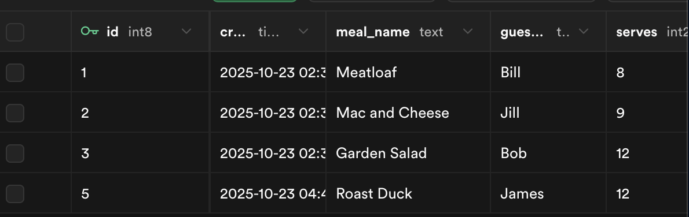

Level Navigation: [1](./db-mini-project-lv-1.md) | [2](./db-mini-project-lv-2.md) | [3](./db-mini-project-lv-3.md) | [4](./db-mini-project-lv-4.md) | [5](./db-mini-project-lv-5.md) | [6](./db-mini-project-lv-6.md) | [7](./db-mini-project-lv-7.md) | [8](./db-mini-project-lv-8.md) | [9](./db-mini-project-lv-9.md) | [10](./db-mini-project-lv-10.md) | [11](./db-mini-project-lv-11.md) | **12** | [13](./db-mini-project-lv-13.md) | [14](./db-mini-project-lv-14.md) | [15](./db-mini-project-lv-15.md) | [16](./db-mini-project-lv-16.md) | [17](./db-mini-project-lv-17.md) | [18](./db-mini-project-lv-18.md) | [19⚡](./db-mini-project-lv-19.md) | [20](./db-mini-project-lv-20.md)

# Level 12: Add Insert Statement

**Goal:** Update your form handler to insert new meals into the database.

**User Story:** As a user, I want my form submission to save the meal to the database so that it persists and can be retrieved later.

---

## What You'll Do

Update your `handleAddMeal` function to include the database insertion logic.

## Instructions

- Update your `handleAddMeal` function to include the insert logic
- Use `await supabase.from("potluck_meals").insert(newMeal)` to insert the new meal
- Keep all the existing form processing logic
- Test the complete flow: submit form → see data in database

## 💡 Code Hints

Need help with database insertion? Check out these snippets:

Show Me: updated form handler

<pre><code class="language-javascript">async function handleAddMeal(event){
    event.preventDefault()
    console.log("handle add meal submitted")
    const mealName = event.target.elements.mealName.value
    const guestName = event.target.elements.guestName.value
    const serves = event.target.elements.serves.value
    const kindOfDish = event.target.elements.kindOfDish.value
    
    const newMeal = {
        meal_name: mealName,
        guest_name: guestName,
        serves: parseInt(serves),
        kind_of_dish: kindOfDish
    }
    
    console.log(newMeal)
    
    // Insert the new meal
    await supabase.from("potluck_meals").insert(newMeal)
}
</code></pre>

Show Me: Verify insert in Supabase

## ✅ Check

1. Fill out the form with new meal data
2. Submit the form
3. Check your Supabase dashboard - the new meal should appear
4. No console errors occur during insertion
5. The data is successfully saved to the database

---

---