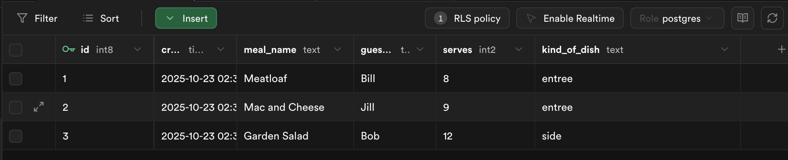
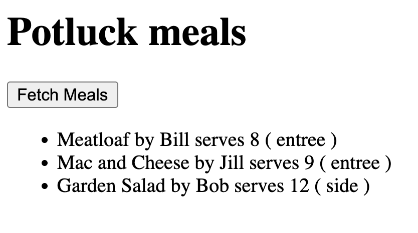
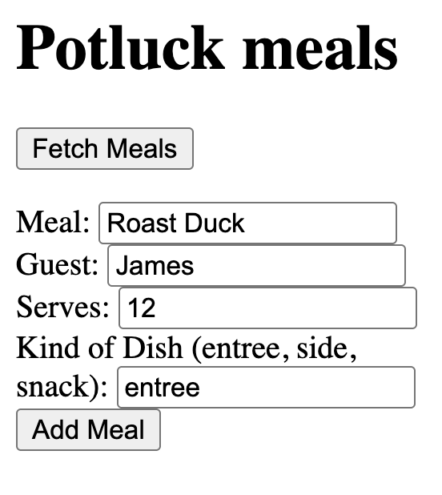
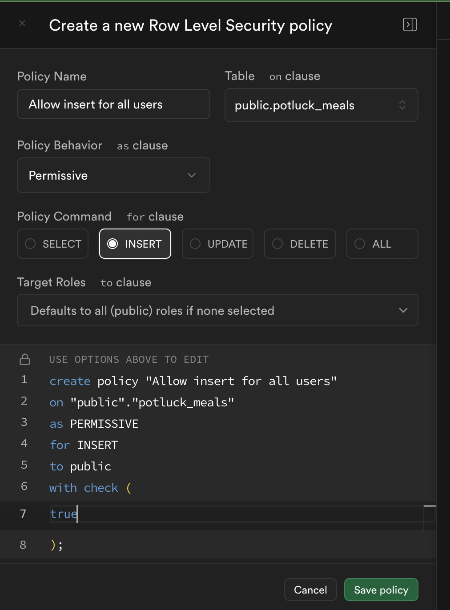
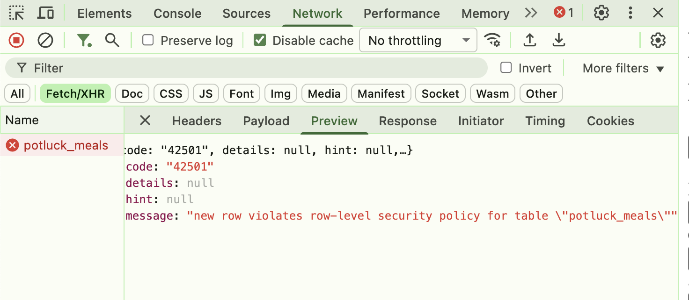
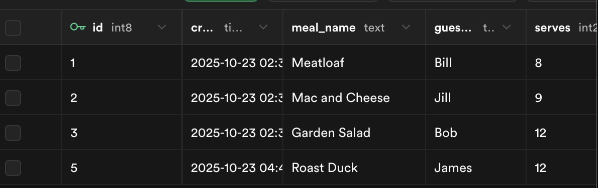
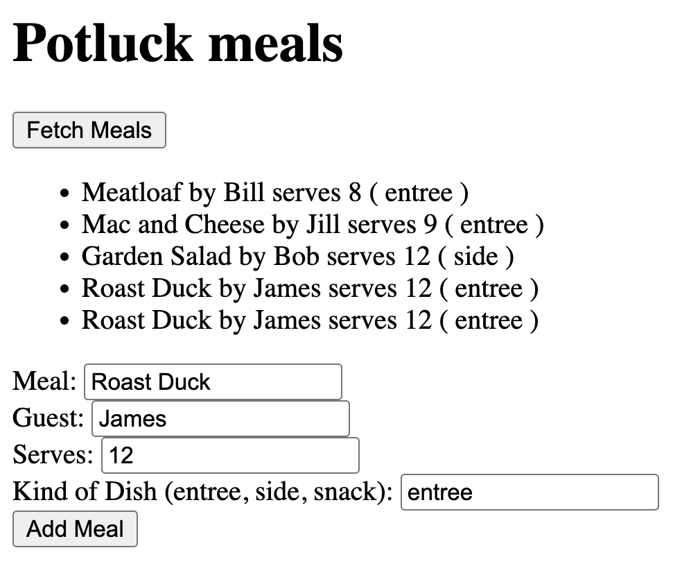
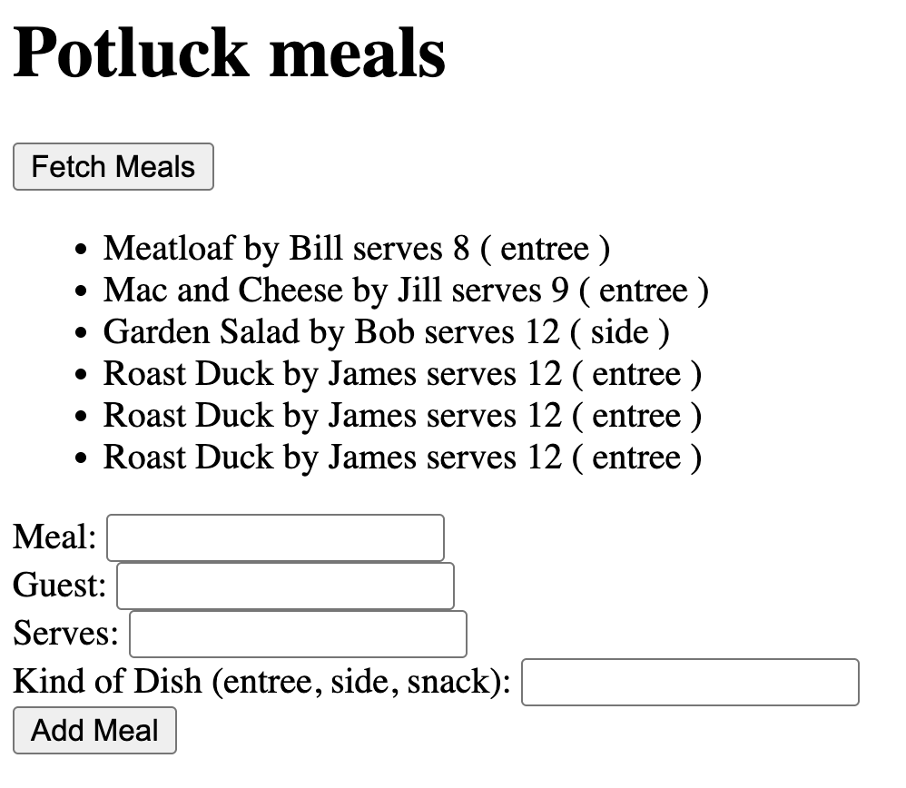
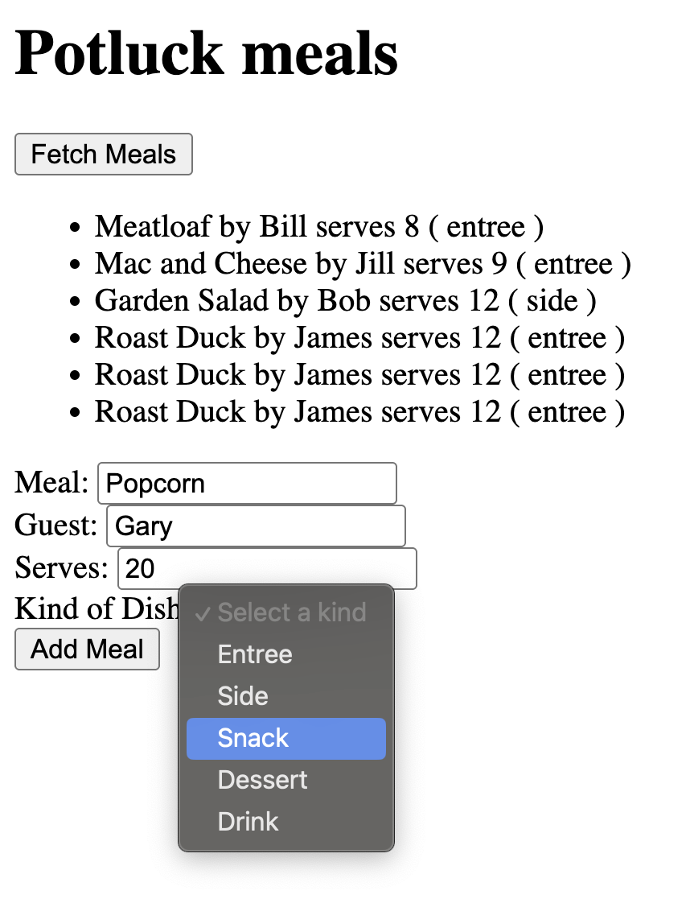

<!-- LEVEL_START -->

# React + Supabase Potluck App Project Guide

Welcome! You're about to build your first full-stack React application with a real database. By the end of this project, you'll have created a potluck meal management app that can store, display, and manage data - just like the apps you use every day!

**What you'll learn:**
- Connect React to a real database (Supabase)
- Build forms that save data permanently
- Display data from a database in your app
- Handle user interactions and events
- Work with database security and permissions

**How this works:**
- Each level builds on what you learned before
- Follow the instructions step-by-step
- Use the code hints when you get stuck
- Check your work with the verification steps
- Start simple and gradually add more features

**Each level includes:**
- **User Story**: What you're building and why it matters
- **Instructions**: Step-by-step guidance to complete the task
- **Code Hints**: Examples and snippets to help you along (use only if you need it.)
- **Diving Deeper**: Extra explanations and videos for curious minds
- **Check**: Verification steps to make sure everything works

---

## Level 1: Planning

**Goal:** Plan your potluck app using the [activity guide](https://rmccrear.github.io/codex-lv3-may-2025/week5/db-mini-project/ACTIVITY_GUIDE.html).

**User Story:** As a developer, I want to plan my database structure and components so that I can build my potluck management app efficiently.

---

### 📋 Before You Start

**Complete the Activity Guide first!** Work through Steps 1-4 of the Activity Guide to:
- Plan your database tables
- Design your component structure
- Map out your app's features
- Set success criteria

This planning will help you build your app more efficiently!

---

### What You'll Do

Take time to plan your potluck app using the structured activity guide.

### Instructions

- **Understand the Requirements**: Review what you need to build
- **Plan Your Database**: Design your tables and relationships
- **Plan Your Components**: Break down your app into manageable pieces
- **Set Success Criteria**: Know what "done" looks like

**Key Planning Questions:**
- What data will you store in each table?
- What components will you need to create?
- How will users interact with your app?
- What features will make your app unique?

**Time Investment**: Spend 15-20 minutes on planning - it will save you hours of debugging later!

### ✅ Check

1. You have reviewed the activity guide
2. You understand the project requirements
3. You have planned your database structure
4. You have designed your component architecture
5. You have set clear success criteria

---

**Attribution:** This project guide was created with assistance from Claude AI (Anthropic).

---

<!-- LEVEL_START -->

# Level 2: Project Setup

**Goal:** Set up your development environment with Vite and React.

**User Story:** As a developer, I want to create a new React project and install dependencies so that I can start building my potluck management app.

---

## What You'll Do

Create a new React project using Vite and install the Supabase client library.

## Instructions

- Create a new React project using Vite: `npm create vite@latest practice-with-db -- --template react`
- Navigate to the project folder: `cd practice-with-db`
- Install dependencies: `npm install`
- Install Supabase client: `npm install @supabase/supabase-js`
- Install tslib to support the Supabase client: `npm install tslib`
- Start the development server to verify setup: `npm run dev`
- Open the project in your code editor

See here for installation details: [Install Supabase Client](https://rmccrear.github.io/codex-lv3-may-2025/week5/supabase-setup/SUPABASE_REACT_SETUP_GUIDE.html#step-7-install-supabase-client-library)

## 💡 Code Hints

Need help with project setup? Check out these snippets:

<details>
<summary>Show Me: Creating the project</summary>

<pre><code class="language-bash">npm create vite@latest practice-with-db -- --template react
cd practice-with-db
npm install
</code></pre>

</details>

<details>
<summary>Show Me: Installing Supabase</summary>

<pre><code class="language-bash">npm install @supabase/supabase-js
</code></pre>

</details>

<details>
<summary>Show Me: Project structure</summary>

<pre><code class="language-bash">practice-with-db/
├── src/
│   ├── components/
│   │   └── PotluckMeals.jsx
│   ├── utils/
│   │   └── supabase.js
│   ├── App.jsx
│   └── main.jsx
├── package.json
└── README.md
</code></pre>

</details>

## 🔍 Diving Deeper

**Why do we need these libraries?**

- **`@supabase/supabase-js`**: This is the official JavaScript client library for Supabase. It provides all the functions we need to connect to our database, perform queries, and handle authentication. Without it, we'd have to write complex HTTP requests manually.

- **`tslib`**: This is a TypeScript runtime library that Supabase depends on. Even though we're using JavaScript, Supabase's internal code uses TypeScript features, so we need this library to support those features.

**Where do these libraries go?**

When you run `npm install`, npm:
1. Downloads the libraries from the npm registry
2. Stores them in the `node_modules/` folder in your project
3. Updates your `package.json` file to record the dependencies

**How to verify installation:**

1. **Check `package.json`**: Open your `package.json` file and look for the `dependencies` section:
   ```json
   {
     "dependencies": {
       "@supabase/supabase-js": "^2.x.x",
       "tslib": "^2.x.x"
     }
   }
   ```

2. **Check `node_modules/`**: Look in your project folder for a `node_modules/` directory. Inside, you should see folders named `@supabase` and `tslib`.

3. **Verify in terminal**: Run `npm list` to see all installed packages and their versions.

## ✅ Check

1. Run `npm run dev` to start your development server
2. Open your browser to `http://localhost:5173`
3. You should see the default Vite + React welcome page
4. Check that `@supabase/supabase-js` is listed in your `package.json` dependencies
5. Open your project folder in VS Code and verify you can see the basic file structure

---

---

<!-- LEVEL_START -->

# Level 3: Database Setup

**Goal:** Configure your Supabase database with tables and security policies.

**User Story:** As a developer, I want to set up my database tables and security policies so that I can store and retrieve potluck data securely.

---

## What You'll Do

Follow the Supabase setup guides to create your database tables and configure access policies.

## Instructions

- Complete the [Supabase Setup Guide](https://rmccrear.github.io/codex-lv3-may-2025/week5/supabase-setup/SUPABASE_SETUP_GUIDE.html) to create your account and project
- Create a `potluck_meals` table with these columns:
  - `meal_name` (text)
  - `guest_name` (text)
  - `serves` (integer)
  - `kind_of_dish` (text)
- Add at least 3 sample meals
- Set up [read policies](https://rmccrear.github.io/codex-lv3-may-2025/week5/supabase-setup/SUPABASE_SETUP_GUIDE.html#step-10-set-up-read-policy-allow-public-read-access) and [insert policies](https://rmccrear.github.io/codex-lv3-may-2025/week5/supabase-setup/SUPABASE_SETUP_GUIDE.html#step-11-set-up-write-policy-allow-public-write-access) for public access
- Follow the [Supabase React Setup Guide](https://rmccrear.github.io/codex-lv3-may-2025/week5/supabase-setup/SUPABASE_REACT_SETUP_GUIDE.html) to configure environment variables
  - Remember to:
    - install your libraries. (supabase and tslib) [instructions](https://rmccrear.github.io/codex-lv3-may-2025/week5/supabase-setup/SUPABASE_REACT_SETUP_GUIDE.html#step-7-install-supabase-client-library)
    - create your `.env.local` file in your project's **root** directory [instructions](https://rmccrear.github.io/codex-lv3-may-2025/week5/supabase-setup/SUPABASE_REACT_SETUP_GUIDE.html#fix-3-use-envlocal-for-better-security)
    - create your supabase utility file in `src/util` Note: do not copy the code for `App.jsx` for this project. We will put the code into a component in later steps [instructions](https://rmccrear.github.io/codex-lv3-may-2025/week5/supabase-setup/SUPABASE_REACT_SETUP_GUIDE.html#fix-3-use-envlocal-for-better-security)

**⚠️ Important Note**: Do NOT use the starter code for `App.jsx` from the Supabase setup guide. That code puts everything in one file, but we'll be organizing our app into separate components. Follow the component structure outlined in Levels 4-6 below instead.

<details>
<summary>Show Me: Sample data in database</summary>



</details>

## 🔍 Diving Deeper

**What are Row Level Security (RLS) policies?**

- **Purpose**: Control who can access which rows in your database
- **Security layer**: Prevents unauthorized access to your data
- **Policy types**: SELECT (read), INSERT (create), UPDATE (modify), DELETE (remove)
- **Why we need them**: Without RLS, anyone with your database URL could access all your data

**Understanding our policies:**

```sql
-- Read policy: Allow everyone to read meals
CREATE POLICY "Enable read access for all users" ON potluck_meals
FOR SELECT USING (true);

-- Insert policy: Allow everyone to add meals  
CREATE POLICY "Enable insert for all users" ON potluck_meals
FOR INSERT WITH CHECK (true);
```

- **`USING (true)`**: For SELECT policies, means "allow if condition is true" (always true = everyone can read)
- **`WITH CHECK (true)`**: For INSERT policies, means "allow if condition is true" (always true = everyone can insert)
- **`true`**: Always evaluates to true, so these policies allow public access

**Environment variables explained:**

```env
VITE_SUPABASE_URL=https://your-project.supabase.co
VITE_SUPABASE_ANON_KEY=your-anon-key-here
```

- **`VITE_` prefix**: Required for Vite to include these variables in your build
- **`.env.local`**: More secure than `.env` (automatically ignored by git)
- **Anon key**: Safe to use in frontend code (has limited permissions)
- **Service key**: Never use in frontend (has full database access)

**📺 Learn More:**
- [RLS Policy (Row-Level Security)](https://www.youtube.com/shorts/YAor6JTaqXI) - Quick explanation of RLS
- [Environment Variables](https://www.youtube.com/watch?v=jqCjflIGH1o) - How environment variables work in Vite
- [Supabase in 100 Seconds](https://www.youtube.com/watch?v=zBZgdTb-dns) - Overview of Supabase platform

## ✅ Check

1. Your Supabase project is created and accessible
2. The `potluck_meals` table exists with the correct columns
3. You have sample data in your table
4. RLS policies are enabled and configured
5. Environment variables are set up in your React project
6. You can see your data in the Supabase dashboard

---

## 📚 Vocabulary

- **[Database (DB)](#database-db)** - A structured place to store and organize data
- **[Supabase](#supabase)** - Backend-as-a-service with PostgreSQL database
- **[RLS Policy](#rls-policy-row-level-security)** - Rules controlling database access
- **[Environment Variables](#environment-variables-env)** - Hidden configuration values
- **[Snake Case](#snake-case)** - Naming style with underscores

---

---

<!-- LEVEL_START -->

# Level 4: Create Basic Component Structure

**Goal:** Create the main PotluckMeals component and import it into your App component.

**User Story:** As a developer, I want to create a component that can fetch and display data from my database so that I can see my potluck meals.

---

## What You'll Do

Create the PotluckMeals component with basic structure and import it into your App component.

## Instructions

- Create `src/components/PotluckMeals.jsx` with basic structure
- Import `useState` from React
- Import your Supabase client from `../utils/supabase`
- Create a state variable for `meals` with initial value of empty array
- Add a basic return statement with a heading and button
- Import and use the PotluckMeals component in `src/App.jsx`

## 💡 Code Hints

Need help with component structure? Check out these snippets:

<details>
<summary>Show Me: PotluckMeals component</summary>

<pre><code class="language-javascript">import { useState } from "react"
import supabase from "../utils/supabase"

export default function PotluckMeals() {
    const [meals, setMeals] = useState([])

    return <>
        <h1>Potluck meals</h1>
        <button>Fetch Meals</button>
        <ul>
            {/* Meals will be displayed here */}
        </ul>
    </>
}
</code></pre>

</details>

<details>
<summary>Show Me: App.jsx import</summary>

<pre><code class="language-javascript">import PotluckMeals from './components/PotluckMeals'

function App() {
  return (<>
    <PotluckMeals/>
  </>)
}

export default App
</code></pre>

</details>

## ✅ Check

1. Your component renders without errors
2. You see "Potluck meals" heading
3. You see a "Fetch Meals" button
4. No console errors about missing imports
5. The component structure is clean and organized

---

---

<!-- LEVEL_START -->

# Level 5: Create Button and Handler (Console Log)

**Goal:** Add a fetch meals function with console logging.

**User Story:** As a developer, I want to create a button handler so that I can test the connection to my database.

---

## What You'll Do

Add the fetch meals function with console logging and connect it to your button.

## Instructions

- Create an `async function handleFetchMeals()` that logs "Fetching meals..." to console
- Add a comment indicating we'll add the actual fetch logic in the next step
- Update the button to call the function with `onClick={handleFetchMeals}`

## 💡 Code Hints

Need help with the button handler? Check out these snippets:

<details>
<summary>Show Me: fetch function</summary>

<pre><code class="language-javascript">async function handleFetchMeals() {
    console.log("Fetching meals...")
    // We'll add the actual fetch logic in the next step
}
</code></pre>

</details>

<details>
<summary>Show Me: button with onClick</summary>

<pre><code class="language-javascript">&lt;button onClick={handleFetchMeals}&gt;Fetch Meals&lt;/button&gt;
</code></pre>

</details>

## ✅ Check

1. Click the "Fetch Meals" button
2. Check the browser console - you should see "Fetching meals..."
3. No JavaScript errors occur
4. The button responds to clicks
5. Console logging is working correctly

---

---

<!-- LEVEL_START -->

# Level 6: Select Data and Console Log

**Goal:** Update the fetch function to actually retrieve data from Supabase.

**User Story:** As a developer, I want to fetch data from my database so that I can see what meals are stored.

---

## What You'll Do

Update the `handleFetchMeals` function to fetch data from Supabase and log it to console.

## Instructions

- Update the `handleFetchMeals` function to use `await supabase.from("potluck_meals").select()`
- Store the result in a variable
- Extract the data from the result
- Log the fetched data to console
- Update the meals state with `setMeals(data)`

## 💡 Code Hints

Need help with data fetching? Check out these snippets:

<details>
<summary>Show Me: updated fetch function</summary>

<pre><code class="language-javascript">async function handleFetchMeals() {
    console.log("Fetching meals...")
    const result = await supabase.from("potluck_meals").select()
    const data = result.data
    console.log("Fetched data:", data);
    setMeals(data);
}
</code></pre>

</details>

## 🔍 Diving Deeper

**What is async/await?**

- **`async`**: Marks a function as asynchronous, meaning it can use `await` and will return a Promise
- **`await`**: Pauses execution until a Promise resolves, then returns the resolved value
- **Why we need it**: Database operations take time (network requests), so we need to wait for them to complete

**Understanding Supabase queries:**

```javascript
const result = await supabase.from("potluck_meals").select()
```

- **`supabase.from("table_name")`**: Specifies which table to query
- **`.select()`**: Retrieves all columns from the table (like `SELECT *` in SQL)
- **`result`**: Contains both `data` and `error` properties
- **`result.data`**: The actual data returned from the database
- **`result.error`**: Any error that occurred during the query

**Error handling pattern:**

Always check for errors when working with databases:
```javascript
if (result.error) {
    console.error('Database error:', result.error);
    return; // Stop execution if there's an error
}
```

**📺 Learn More:**
- [The Async Await Episode I Promised](https://www.youtube.com/watch?v=vn3tm0quoqE) - Deep dive into async/await
- [SQL Explained in 100 Seconds](https://www.youtube.com/watch?v=zsjvFFKOm3c) - Understanding SQL basics
- [MySQL - The Basics](https://www.youtube.com/watch?v=Cz3WcZLRaWc) - Comprehensive SQL tutorial

## ✅ Check

1. Click the "Fetch Meals" button
2. Check the browser console - you should see the fetched data
3. The meals state is updated with the data
4. No console errors occur
5. Data is successfully retrieved from Supabase

---

## 📚 Vocabulary

- **[Async](#async)** - Keyword that makes a function return a Promise
- **[await](#await)** - Pauses inside an async function until a Promise is done
- **[SELECT](#select)** - SQL command that reads data from a database
- **[Database (DB)](#database-db)** - A structured place to store and organize data
- **[Supabase](#supabase)** - Backend-as-a-service with PostgreSQL database

---

---

<!-- LEVEL_START -->

# Level 7: Display Data with For Loop

**Goal:** Display the fetched meals using a for loop.

**User Story:** As a user, I want to see the meals displayed on the page so that I can view what's planned for the potluck.

---

## What You'll Do

Add display logic using a for loop to render each meal in the list.

## Instructions

- Create a `mealsDisplay` array
- Use a for loop to iterate through the meals array
- For each meal, push a `<li>` element with the meal information
- Include the meal name, guest name, serves count, and dish type
- Display the meals using `{mealsDisplay}` in the JSX

## 💡 Code Hints

Need help with the display loop? Check out these snippets:

<details>
<summary>Show Me: display loop</summary>

<pre><code class="language-javascript">const mealsDisplay = []
for (let i = 0; i < meals.length; i++) {
    mealsDisplay.push(
        &lt;li key={meals[i].id}&gt; 
            {meals[i].meal_name} by {meals[i].guest_name} serves {meals[i].serves} ( {meals[i].kind_of_dish} ) 
        &lt;/li&gt;
    )
}
</code></pre>

</details>

<details>
<summary>Show Me: displaying the meals</summary>

<pre><code class="language-javascript">&lt;ul&gt;
    {mealsDisplay}
&lt;/ul&gt;
</code></pre>

</details>

<details>
<summary>Show Me: Meals displayed in app</summary>



</details>

## 🔍 Diving Deeper

**Why do we need the `key` prop?**

- **React requirement**: When rendering lists, React needs a unique identifier for each item
- **Performance**: Helps React efficiently update the DOM when the list changes
- **Best practice**: Use a unique, stable identifier (like `id`) rather than array index
- **What happens without it**: React will show warnings and may not update efficiently

**Understanding JSX in loops:**

```javascript
mealsDisplay.push(
    <li key={meals[i].id}> 
        {meals[i].meal_name} by {meals[i].guest_name} serves {meals[i].serves} ( {meals[i].kind_of_dish} ) 
    </li>
)
```

- **JSX elements**: We're creating React elements (not HTML strings)
- **Template literals**: Using `{variable}` to insert JavaScript values into JSX
- **Array building**: We build an array of JSX elements, then render it all at once

**Alternative approaches:**

You could also use `.map()` instead of a for loop:
```javascript
const mealsDisplay = meals.map(meal => (
    <li key={meal.id}>
        {meal.meal_name} by {meal.guest_name} serves {meal.serves} ({meal.kind_of_dish})
    </li>
));
```

**📺 Learn More:**
- [JavaScript Modules in 100 Seconds](https://www.youtube.com/watch?v=qgRUr-YUk1Q) - Understanding modules and imports
- [Arrow Functions - Beau teaches JavaScript](https://www.youtube.com/watch?v=22fyYvxz-do) - Modern JavaScript function syntax

## ✅ Check

1. Click the "Fetch Meals" button
2. Your meals should appear in a list below the button
3. Each meal shows: name, guest, serves count, and dish type
4. The list updates when you click the button again
5. If no data appears, check your Supabase connection and RLS policies

---

## 📚 Vocabulary

- **[List Scrolling Pattern](#list-scrolling-pattern)** - Iterating through a list to process each item
- **[JSX](#jsx)** - Special syntax used in React that looks like HTML
- **[Template Literal](#template-literal)** - Way to put variables into strings using backticks
- **[Array Literal](#array-literal)** - Syntax to create an array using square brackets
- **[Index](#index)** - Number that tells you an item's position in a list

---

---

<!-- LEVEL_START -->

# Level 8: Test Data Fetching

**Goal:** Verify that your data fetching and display is working correctly.

**User Story:** As a developer, I want to test my data fetching functionality so that I can ensure everything is working properly.

---

## What You'll Do

Test your data fetching functionality and verify the results.

## Instructions

- Run your development server: `npm run dev`
- Click the "Fetch Meals" button
- Verify that your meals are displayed
- Check the browser console for any errors
- Test multiple times to ensure consistency

## ✅ Check

1. Development server is running without errors
2. Clicking "Fetch Meals" displays the meals
3. All meal information is shown correctly
4. No console errors occur
5. The functionality works consistently

---

---

<!-- LEVEL_START -->

# Level 9: Add Form Structure

**Goal:** Add a form to your PotluckMeals component for adding new meals.

**User Story:** As a user, I want to fill out a form to add my dish to the potluck so that others can see what I'm bringing.

---

## What You'll Do

Add a form with input fields for meal details to your component.

## Instructions

- Add a form element with `onSubmit={handleAddMeal}` inside your return statement, after the ul element
- Create input fields for:
  - Meal name (text input with name="mealName")
  - Guest name (text input with name="guestName")
  - Serves count (number input with name="serves")
  - Kind of dish (text input with name="kindOfDish")
- Add a submit button with type="submit" and text "Add Meal"
- Wrap the form in a div element

## 💡 Code Hints

Need help with form structure? Check out these snippets:

<details>
<summary>Show Me: form JSX</summary>

<pre><code class="language-javascript">// Add this inside your return statement, after the ul element
&lt;div&gt;
    &lt;form onSubmit={handleAddMeal}&gt;
        &lt;label&gt;
            Meal: &lt;input type="text" name="mealName" /&gt;
        &lt;/label&gt;
        &lt;br/&gt;
        &lt;label&gt;
            Guest: &lt;input type="text" name="guestName" /&gt;
        &lt;/label&gt;
        &lt;br/&gt;
        &lt;label&gt;
            Serves: &lt;input type="number" name="serves" /&gt;
        &lt;/label&gt;
        &lt;br/&gt;
        &lt;label&gt;
            Kind of Dish: &lt;input type="text" name="kindOfDish" /&gt;
        &lt;/label&gt;
        &lt;br/&gt;
        &lt;button type="submit"&gt;Add Meal&lt;/button&gt;
    &lt;/form&gt;
&lt;/div&gt;
</code></pre>

</details>

<details>
<summary>Show Me: Form added</summary>



</details>

## ✅ Check

1. You see a form with four input fields
2. Each input has a clear label
3. The form has a submit button
4. All input fields have proper name attributes
5. The form is positioned below the meals list

---

---

<!-- LEVEL_START -->

# Level 10: Add Event Handler

**Goal:** Create the handleAddMeal function to process form submissions.

**User Story:** As a developer, I want to create a form handler so that I can process the form data when users submit it.

---

## What You'll Do

Add the `handleAddMeal` function to your component to handle form submissions.

## Instructions

- Create an `async function handleAddMeal(event)` that:
  - Calls `event.preventDefault()` to prevent page refresh
  - Logs "handle add meal submitted" to console
  - Extracts form data using `event.target.elements`
  - Creates a `newMeal` object with the form data
  - Converts serves to an integer using `parseInt(serves)`
  - Logs the newMeal object to console
  - Adds a comment indicating we'll add insert logic in the next step

## 💡 Code Hints

Need help with the form handler? Check out these snippets:

<details>
<summary>Show Me: form handler</summary>

<pre><code class="language-javascript">async function handleAddMeal(event){
    event.preventDefault()
    console.log("handle add meal submitted")
    const mealName = event.target.elements.mealName.value
    const guestName = event.target.elements.guestName.value
    const serves = event.target.elements.serves.value
    const kindOfDish = event.target.elements.kindOfDish.value
    
    const newMeal = {
        meal_name: mealName,
        guest_name: guestName,
        serves: parseInt(serves),
        kind_of_dish: kindOfDish
    }
    
    console.log(newMeal)
    // We'll add the insert logic in the next step
}
</code></pre>

</details>

## 🔍 Diving Deeper

**Understanding form events:**

- **`event.preventDefault()`**: Stops the browser's default form submission behavior (page refresh)
- **`event.target`**: References the form element that triggered the event
- **`event.target.elements`**: Collection of all form input elements with `name` attributes
- **Why we need it**: Without preventDefault, the page would refresh and lose our React state

**Exploring the event object:**

To better understand how events work, try adding this to your form handler:

```javascript
function handleAddMeal(event) {
    console.log(event); // Examine the entire event object
    console.log(event.target); // Look at the form element
    console.log(event.target.elements); // See all form inputs
    
    event.preventDefault();
    // ... rest of your code
}
```

**What you'll see in the console:**
- **`event`**: A large object with many properties (type, target, preventDefault, etc.)
- **`event.target`**: The `<form>` element that was submitted
- **`event.target.elements`**: A collection of all inputs with `name` attributes

**Form data extraction pattern:**

```javascript
const mealName = event.target.elements.mealName.value
const guestName = event.target.elements.guestName.value
```

- **`elements.mealName`**: Gets the input with `name="mealName"`
- **`.value`**: Gets the current value from that input
- **Uncontrolled inputs**: We're not using React state to control the input values
- **Alternative**: Could use `useState` for each field (controlled inputs), but this is simpler

**Data type conversion:**

```javascript
serves: parseInt(serves)
```

- **`parseInt()`**: Converts string to integer
- **Why needed**: HTML form inputs always return strings, but our database expects numbers
- **Error handling**: `parseInt("abc")` returns `NaN` - in production, you'd validate this

**Object creation pattern:**

```javascript
const newMeal = {
    meal_name: mealName,
    guest_name: guestName,
    serves: parseInt(serves),
    kind_of_dish: kindOfDish
}
```

- **Property mapping**: Database column names (`meal_name`) vs. form field names (`mealName`)
- **Data structure**: Creating an object that matches our database schema
- **Consistency**: This object structure must match what Supabase expects

**📺 Learn More:**
- [JavaScript Visualized - Event Loop](https://www.youtube.com/watch?v=eiC58R16hb8) - Understanding how events work
- [Learn JavaScript STRICT EQUALITY](https://www.youtube.com/watch?v=O7aUm0AuUy4) - Data type comparisons

## ✅ Check

1. Fill out the form with test data
2. Submit the form
3. Check the browser console - you should see "handle add meal submitted"
4. You should see the newMeal object logged to console
5. No page refresh occurs when submitting

---

## 📚 Vocabulary

- **[Event Listener](#event-listener)** - Code that waits for something to happen and runs a function
- **[Function / Anonymous Function](#function--anonymous-function)** - Reusable block of code
- **[String](#string)** - A piece of text inside quotes
- **[Triple Equals (===)](#triple-equals-)** - Strict comparison that checks both value and type
- **[Scoping](#scoping)** - Rules that decide where variables can be used

---

---

<!-- LEVEL_START -->

# Level 11: Create Insert RLS Policy

**Goal:** Set up a write policy for your potluck_meals table.

**User Story:** As a developer, I want to configure database security policies so that users can insert new meals into the database.

---

## What You'll Do

Follow the Supabase Setup Guide to set up a write policy for your potluck_meals table.

## Instructions

- Follow the [Supabase Setup Guide - Step 11](https://rmccrear.github.io/codex-lv3-may-2025/week5/supabase-setup/SUPABASE_SETUP_GUIDE.html#step-11-set-up-write-policy-allow-public-write-access) to set up a write policy
- Click **"New Policy"** in your Supabase dashboard
- Give it a policy name (e.g., "Enable insert for all users")
- Select **"INSERT"** operation
- Add `true` to the **"with check"** statement in the policy
- Click **"Save"**

This allows anyone to **create** new rows in your table.

**🔒 Cybersecurity Reflection**: Think about this statement from a security perspective. What are the potential risks of allowing "anyone" to create new rows in your database? Consider:
- What could happen if malicious users submit inappropriate data?
- How might this policy affect data integrity?
- What would be a more secure approach for a production application?
- Why is this policy acceptable for learning projects but not for real applications?

**Note**: This policy is intentionally permissive for learning purposes. In production applications, you would implement proper authentication and authorization controls.

<details>
<summary>Show Me: RLS Policy for inserts</summary>



</details>

<details>
<summary>Show Me: Potential RLS error</summary>



</details>

## ✅ Check

1. You have created a new RLS policy
2. The policy allows INSERT operations
3. The policy uses `true` in the "with check" statement
4. The policy is saved and active
5. You understand the security implications

---

---

<!-- LEVEL_START -->

# Level 12: Add Insert Statement

**Goal:** Update your form handler to insert new meals into the database.

**User Story:** As a user, I want my form submission to save the meal to the database so that it persists and can be retrieved later.

---

## What You'll Do

Update your `handleAddMeal` function to include the database insertion logic.

## Instructions

- Update your `handleAddMeal` function to include the insert logic
- Use `await supabase.from("potluck_meals").insert(newMeal)` to insert the new meal
- Keep all the existing form processing logic
- Test the complete flow: submit form → see data in database

## 💡 Code Hints

Need help with database insertion? Check out these snippets:

<details>
<summary>Show Me: updated form handler</summary>

<pre><code class="language-javascript">async function handleAddMeal(event){
    event.preventDefault()
    console.log("handle add meal submitted")
    const mealName = event.target.elements.mealName.value
    const guestName = event.target.elements.guestName.value
    const serves = event.target.elements.serves.value
    const kindOfDish = event.target.elements.kindOfDish.value
    
    const newMeal = {
        meal_name: mealName,
        guest_name: guestName,
        serves: parseInt(serves),
        kind_of_dish: kindOfDish
    }
    
    console.log(newMeal)
    
    // Insert the new meal
    await supabase.from("potluck_meals").insert(newMeal)
}
</code></pre>

</details>

<details>
<summary>Show Me: Verify insert in Supabase</summary>



</details>

## 🔍 Diving Deeper

**Understanding CRUD operations:**

- **C**reate: `INSERT` - Adding new records to the database
- **R**ead: `SELECT` - Retrieving data from the database  
- **U**pdate: `UPDATE` - Modifying existing records
- **D**elete: `DELETE` - Removing records from the database

**Database insertion explained:**

```javascript
await supabase.from("potluck_meals").insert(newMeal)
```

- **`supabase.from("table_name")`**: Specifies which table to insert into
- **`.insert(data)`**: Inserts the provided data as a new row
- **`await`**: Waits for the insertion to complete before continuing
- **No return value needed**: We're not using the returned data, just inserting

**Exploring network requests:**

To see what's actually being sent to Supabase, open your browser's Developer Tools:

1. **Open Developer Tools**: Press `F12` or right-click → "Inspect"
2. **Go to Network Tab**: Click on the "Network" tab
3. **Submit your form**: Fill out and submit the form
4. **Look for the request**: You'll see a request to your Supabase URL
5. **Examine the data**: Click on the request to see:
   - **Request Payload**: The data being sent (your `newMeal` object)
   - **Response**: What Supabase sends back
   - **Headers**: Authentication and other metadata

**What you'll see:**
- **Request URL**: `https://your-project.supabase.co/rest/v1/potluck_meals`
- **Request Method**: `POST` (for inserting data)
- **Request Payload**: Your form data as JSON
- **Response**: Confirmation that the data was inserted

**Data persistence:**

- **Before insert**: Data only exists in your React component's memory
- **After insert**: Data is permanently stored in the Supabase database
- **Verification**: You can check the Supabase dashboard to see the new record
- **Retrieval**: The data will be available even after refreshing the page

**Error handling considerations:**

In production apps, you'd want to handle potential errors:
```javascript
const { data, error } = await supabase.from("potluck_meals").insert(newMeal)
if (error) {
    console.error('Insert failed:', error);
    // Show user-friendly error message
} else {
    console.log('Meal added successfully:', data);
    // Update UI to show success
}
```

**Database constraints:**

- **Required fields**: Database will reject inserts if required columns are missing
- **Data types**: Database will reject inserts if data types don't match (e.g., string in integer column)
- **Unique constraints**: Database will reject duplicate values in unique columns
- **Foreign keys**: Database will reject inserts that violate relationship rules

**📺 Learn More:**
- [MySQL - The Basics](https://www.youtube.com/watch?v=Cz3WcZLRaWc) - Comprehensive SQL tutorial including INSERT
- [SQL Explained in 100 Seconds](https://www.youtube.com/watch?v=zsjvFFKOm3c) - Quick SQL overview
- [Supabase in 100 Seconds](https://www.youtube.com/watch?v=zBZgdTb-dns) - Understanding the platform

## ✅ Check

1. Fill out the form with new meal data
2. Submit the form
3. Check your Supabase dashboard - the new meal should appear
4. No console errors occur during insertion
5. The data is successfully saved to the database

---

## 📚 Vocabulary

- **[INSERT](#insert)** - SQL command that adds a new row into a table
- **[Database (DB)](#database-db)** - A structured place to store and organize data
- **[Persistence / Persist](#persistence--persist)** - When data stays saved after refreshing
- **[Table](#table)** - Collection of related data organized into rows and columns
- **[Row / Record](#row--record)** - One entry in a table

---

---

<!-- LEVEL_START -->

# Level 13: Test Insert and Verify in Supabase Dashboard

**Goal:** Verify that your insert functionality is working correctly.

**User Story:** As a developer, I want to verify that my data insertion is working so that I can ensure the database is being updated properly.

---

## What You'll Do

Test your insert functionality and verify the results in the Supabase dashboard.

## Instructions

- Fill out the form with new meal data
- Submit the form
- Check your Supabase dashboard to verify the meal was inserted
- Test with different types of data
- Verify the data appears correctly in the database

## ✅ Check

1. Form submission completes without errors
2. New meal appears in Supabase dashboard
3. All form fields are saved correctly
4. Data types are preserved (integer for serves)
5. Multiple submissions work correctly

---

---

<!-- LEVEL_START -->

# Level 14: Select Data Back Out and Update List

**Goal:** Refresh the meals list after inserting a new meal.

**User Story:** As a user, I want to see my new meal appear in the list immediately after submitting the form so that I can confirm it was added.

---

## What You'll Do

Update your `handleAddMeal` function to refresh the meals list after inserting.

## Instructions

- Update your `handleAddMeal` function to refresh the meals list after inserting
- After the insert statement, fetch the updated meals list using `supabase.from("potluck_meals").select()`
- Update the meals state with the new data using `setMeals(data)`
- Test that the list updates automatically after form submission

## 💡 Code Hints

Need help with refreshing the list? Check out these snippets:

<details>
<summary>Show Me: updated form handler with refresh</summary>

<pre><code class="language-javascript">async function handleAddMeal(event){
    event.preventDefault()
    console.log("handle add meal submitted")
    const mealName = event.target.elements.mealName.value
    const guestName = event.target.elements.guestName.value
    const serves = event.target.elements.serves.value
    const kindOfDish = event.target.elements.kindOfDish.value
    
    const newMeal = {
        meal_name: mealName,
        guest_name: guestName,
        serves: parseInt(serves),
        kind_of_dish: kindOfDish
    }
    
    console.log(newMeal)
    
    // Insert the new meal
    await supabase.from("potluck_meals").insert(newMeal)
    
    // Refresh the meals list
    const response = await supabase.from("potluck_meals").select()
    const data = response.data
    setMeals(data)
}
</code></pre>

</details>

<details>
<summary>Show Me: Display meals after submit</summary>



</details>

## ✅ Check

1. Submit a new meal through the form
2. The meals list updates automatically
3. Your new meal appears in the list
4. The list shows all meals including the new one
5. No manual refresh is needed

---

---

<!-- LEVEL_START -->

# Level 15: Clear Inputs After Submit

**Goal:** Clear the form inputs after successful submission.

**User Story:** As a user, I want the form to clear after I submit it so that I can easily add another meal.

---

## What You'll Do

Update your `handleAddMeal` function to clear the form inputs after submission.

## Instructions

- Update your `handleAddMeal` function to clear the form inputs after successful submission
- Clear each input field by setting its value to an empty string
- Use `event.target.elements` to access each input field
- Clear all four input fields: mealName, guestName, serves, and kindOfDish

## 💡 Code Hints

Need help with clearing inputs? Check out these snippets:

<details>
<summary>Show Me: complete form handler with clearing</summary>

<pre><code class="language-javascript">async function handleAddMeal(event){
    event.preventDefault()
    console.log("handle add meal submitted")
    const mealName = event.target.elements.mealName.value
    const guestName = event.target.elements.guestName.value
    const serves = event.target.elements.serves.value
    const kindOfDish = event.target.elements.kindOfDish.value
    
    const newMeal = {
        meal_name: mealName,
        guest_name: guestName,
        serves: parseInt(serves),
        kind_of_dish: kindOfDish
    }
    
    console.log(newMeal)
    
    // Insert the new meal
    await supabase.from("potluck_meals").insert(newMeal)
    
    // Refresh the meals list
    const response = await supabase.from("potluck_meals").select()
    const data = response.data
    setMeals(data)
    
    // Clear the form inputs
    event.target.elements.mealName.value = ""
    event.target.elements.guestName.value = ""
    event.target.elements.serves.value = ""
    event.target.elements.kindOfDish.value = ""
}
</code></pre>

</details>

<details>
<summary>Show Me: Clear inputs after submit</summary>



</details>

## ✅ Check

1. Submit a new meal through the form
2. All form inputs clear automatically
3. The form is ready for the next entry
4. The meals list still updates correctly
5. You can immediately add another meal

---

---

<!-- LEVEL_START -->

# Level 16: Add Select Dropdown (Challenge)

**Goal:** Replace the text input for dish type with a dropdown for better data consistency.

**User Story:** As a user, I want to select from predefined dish types so that the data is consistent and easier to filter.

---

## What You'll Do

Replace the "Kind of Dish" text input with a select dropdown containing predefined options.

## Instructions

- Replace the text input for "Kind of Dish" with a select dropdown
- Add option elements for: entree, side, snack, dessert, drink
- Include a disabled default option: "Select a kind"
- Use `defaultValue=""` on the select element
- Test that the dropdown works correctly with form submission

## 💡 Code Hints

Need help with select dropdown? Check out these snippets:

<details>
<summary>Show Me: select dropdown</summary>

<pre><code class="language-javascript">&lt;label&gt;
    Kind of Dish:
    &lt;select name="kindOfDish" defaultValue=""&gt;
        &lt;option value="" disabled&gt;Select a kind&lt;/option&gt;
        &lt;option value="entree"&gt;Entree&lt;/option&gt;
        &lt;option value="side"&gt;Side&lt;/option&gt;
        &lt;option value="snack"&gt;Snack&lt;/option&gt;
        &lt;option value="dessert"&gt;Dessert&lt;/option&gt;
        &lt;option value="drink"&gt;Drink&lt;/option&gt;
    &lt;/select&gt;
&lt;/label&gt;
</code></pre>

</details>

<details>
<summary>Show Me: Option select dropdown</summary>



</details>

## ✅ Check

1. The text input is replaced with a dropdown
2. You can select from the predefined options
3. The form still submits correctly
4. Data is saved with the selected value
5. The dropdown resets after form submission

---

---

<!-- LEVEL_START -->

# Level 17: Create Beverages Table and Component

**Goal:** Create another table and component for Beverages following the same pattern as meals.

**User Story:** As a developer, I want to create additional tables and components so that I can manage different types of potluck items.

---

## What You'll Do

Create a beverages table and component following the same pattern as the meals component.

## Instructions

- Create a `beverages` table with appropriate columns (e.g., `beverage_name`, `guest_name`, `quantity`, `type_of_drink`)
- Set up RLS policies for read and insert access
- Create a `Beverages.jsx` component following the same pattern as `PotluckMeals.jsx`
- Import and display the Beverages component in your App.jsx

## ✅ Check

1. The beverages table exists in your Supabase dashboard
2. RLS policies are configured for the beverages table
3. The Beverages component renders without errors
4. You can fetch and display data from the beverages table
5. The form works for adding new beverages

---

---

<!-- LEVEL_START -->

# Level 18: Create Utensils Table and Component

**Goal:** Create a table and component for Utensils following the same pattern.

**User Story:** As a developer, I want to create additional tables and components so that I can manage different types of potluck items.

---

## What You'll Do

Create a utensils table and component for managing potluck utensils.

## Instructions

- Design your own columns for the utensils table (e.g., `item_name`, `guest_name`, `quantity`, `item_type`)
- Set up RLS policies for read and insert access
- Create a `Utensils.jsx` component following the same pattern
- Import and display the Utensils component in your App.jsx

## ✅ Check

1. The utensils table exists in your Supabase dashboard
2. RLS policies are configured for the utensils table
3. The Utensils component renders without errors
4. You can fetch and display data from the utensils table
5. The form works for adding new utensils

---

---

<!-- LEVEL_START -->

# Level 19: Bonus Challenges ⚡

**CHALLENGE LEVEL**

**User Story:** As a developer, I want to implement advanced features so that I can create a more impressive and functional app.

---

## What You'll Do

Choose from these advanced challenges to extend your potluck app.

## Challenge Options

Complete at least 2 of the following challenges:

### Challenge 1: Select Dropdown
Remember that [Level 16](./db-mini-project-lv-16.md) (select dropdown) is also a challenge that you can implement!

### Challenge 2: Creative Table
Create another table that you think would improve your app (e.g., dietary restrictions, allergies, etc.). Decide on the columns yourself.

### Challenge 3: Styling
Style your app using CSS or Bootstrap to make it more visually appealing.

### Challenge 4: Conditional Styling
Add conditional styling based on the type of dish or other data.

### Challenge 5: Creative Display
Use elements other than `<li>` tags to display your items (cards, tables, etc.).

### Challenge 6: Component Breakdown
Break your app into smaller, reusable components with props.

### Challenge 7: File Upload
Have an option to upload a file. Consider using Cloudinary and an "upload url". This will take some research.

## ✅ Check

1. Choose at least 2 challenges to implement
2. Test your new features thoroughly
3. Update your README with new features
4. Commit your changes with descriptive messages
5. Consider adding screenshots or GIFs

---

---

<!-- LEVEL_START -->

# Level 20: Project Complete! 🎉

**Congratulations!** You've successfully built a complete React + Supabase potluck management app!

## What You've Accomplished

You've built a fully functional app that demonstrates:

- ✅ **React Fundamentals** - Component creation, state management, event handling
- ✅ **Supabase Integration** - Database connection, CRUD operations
- ✅ **Form Handling** - Form submission, input validation, data processing
- ✅ **Database Security** - Row Level Security (RLS) policies
- ✅ **Environment Variables** - Secure credential management
- ✅ **Async/Await** - Handling asynchronous operations
- ✅ **Component Architecture** - Breaking down applications into reusable pieces

## Skills You've Developed

Through this project, you've gained hands-on experience with:

- Setting up a modern React development environment with Vite
- Creating and managing Supabase database projects
- Building React components with state management
- Implementing CRUD operations with a backend database
- Working with forms and user input
- Understanding database security and RLS policies
- Managing environment variables securely
- Debugging React applications with database integration

## Next Steps

After completing this project, consider exploring:

- User authentication with Supabase Auth
- Real-time subscriptions with Supabase Realtime
- File storage with Supabase Storage
- Advanced React patterns (Context API, custom hooks)
- Testing with React Testing Library
- Deployment with Vercel or Netlify

## Resources

- [React Official Documentation](https://react.dev)
- [Supabase Documentation](https://supabase.com/docs)
- [Vite Documentation](https://vitejs.dev)
- [MDN Web Docs - JavaScript](https://developer.mozilla.org/en-US/docs/Web/JavaScript)

## Share Your Work!

Consider:
- Pushing your project to GitHub
- Deploying to Netlify or Vercel
- Adding it to your portfolio
- Sharing with friends and getting feedback

---

## 🎊 Well Done!

You've completed a significant milestone in your React and database journey. Your potluck app demonstrates your ability to build full-stack web applications with modern tools.

Keep building, keep learning, and keep growing as a developer!

**Project Status: Complete!** ✨

---

## Troubleshooting Guide

### Common Issues and Solutions

**Environment Variables Not Loading**: Make sure your `.env.local` file is in the project root and variables start with `VITE_`

**RLS Policy Errors**: Check SQL syntax and ensure policies are properly quoted

**CORS Issues**: Verify your Supabase URL and keys are correct

**Form Not Submitting**: Ensure you have `event.preventDefault()` in your handler

### Getting Help:

- Check the browser console for error messages
- Verify your Supabase dashboard for data changes
- Review the Supabase documentation for API reference
- Use `console.log()` statements to debug data flow

---

**Attribution:** This project guide was created with assistance from Claude AI (Anthropic).

---