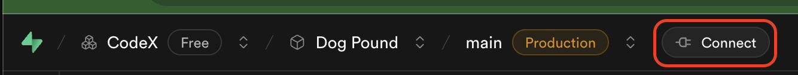
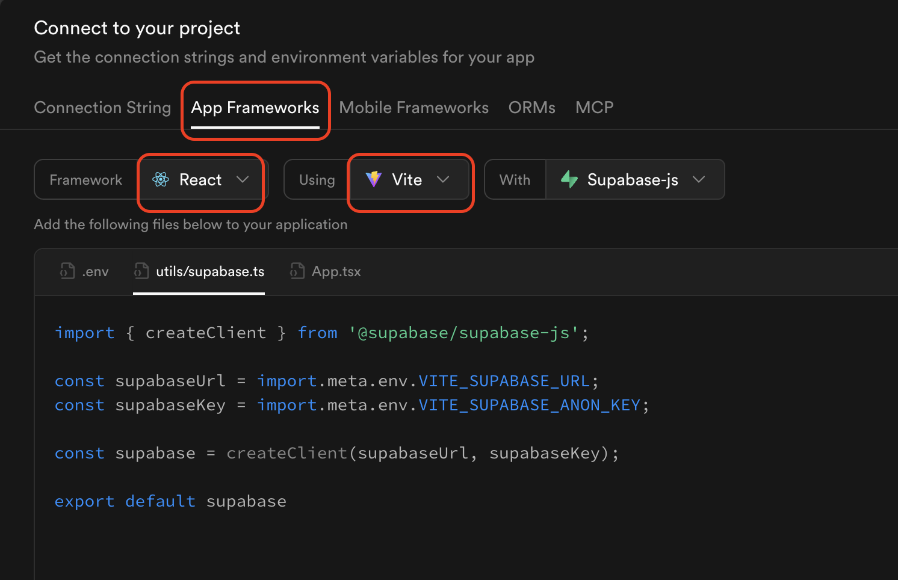
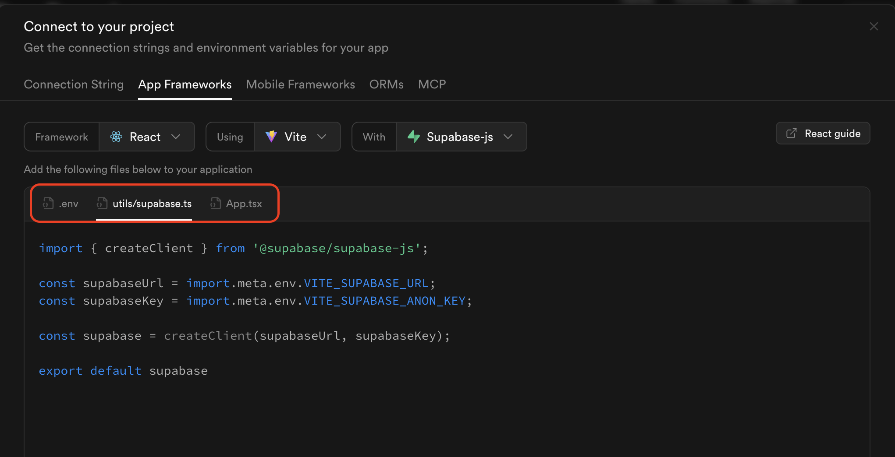
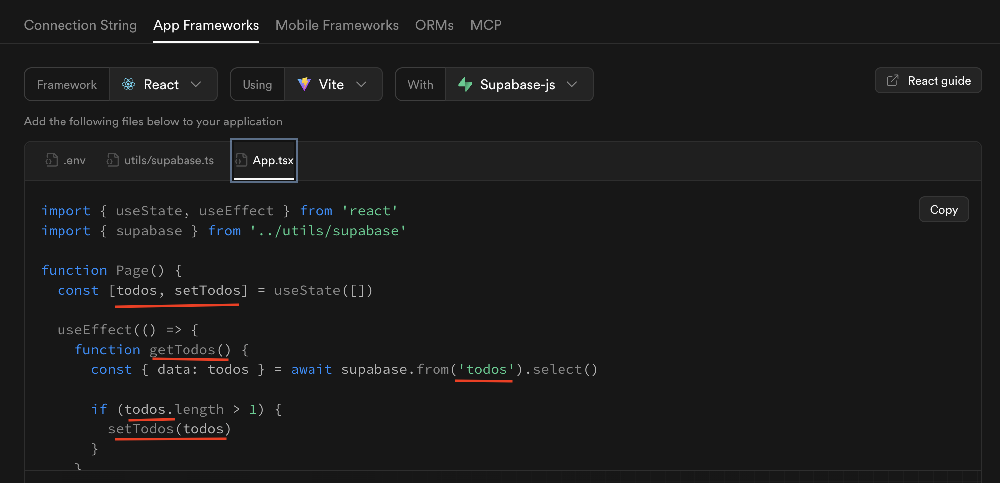
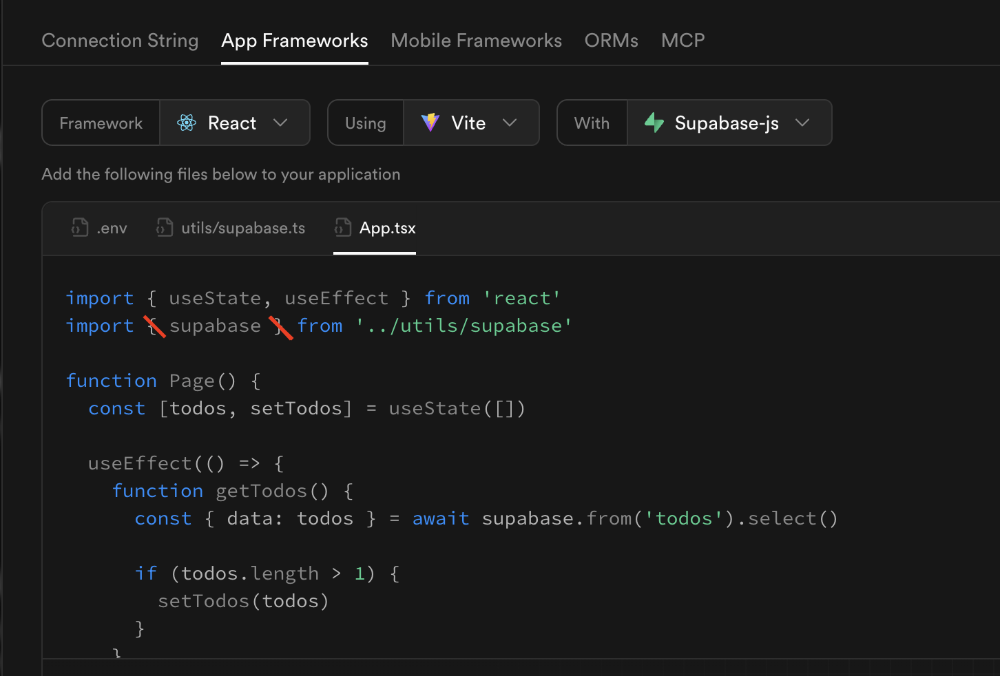

# Connecting Supabase to Your React App

Learn how to integrate your Supabase database with a React application to read and write data from your frontend.

**Prerequisites:**
- ✅ Completed [Supabase Setup Guide](./SUPABASE_SETUP_GUIDE.md)
- ✅ Supabase project with a table and data
- ✅ React app created with Vite

**Time Required:** 20-30 minutes

---

## What You'll Learn

By the end of this guide, you'll be able to:
- Install the Supabase JavaScript client
- Configure your React app with API credentials
- Fetch data from your Supabase table
- Display database data in your React components
- Create new records from React forms

---

## Step 1: Get Your Supabase Connection Files

Supabase provides starter code to help you connect quickly!

Go to your Supabase project dashboard and click on the **"Connect"** tab in the left sidebar.

<details>
<summary>Show Me</summary>

</details>

**What you'll find:**
- Starter code templates for different frameworks
- Pre-configured connection files
- Your project's API credentials

---

## Step 2: Select Your Project Framework Settings

In the Connect tab, select **"React"** or **"JavaScript"** as your framework.

<details>
<summary>Show Me</summary>

</details>

**What happens:**
- Supabase generates custom code for your project
- The code includes your unique API URL and keys
- Three files are provided: client configuration, data fetching, and page component

**Note:** You can choose TypeScript (.ts/.tsx) or JavaScript (.js/.jsx) - both work the same way!

---

## Step 3: Copy the Three Starter Files

Supabase provides three files to get you started. Copy these into your React project.

<details>
<summary>Show Me</summary>

</details>

**The three files you'll need to modify:**

1. **`.env`** - Environment variables file
   - Stores your Supabase URL and API key securely
   - Keeps sensitive data out of your code
   - Create in your project root: `.env`

2. **`src/utils/supabase.js`** - Supabase client configuration
   - Creates connection to your database
   - Uses environment variables for API credentials
   - Copy to: `src/utils/supabase.js`

3. **`src/App.jsx`** - Main React component
   - Shows how to fetch and display data from Supabase
   - Demonstrates useState and useEffect with database
   - Modify your existing App.jsx file

**File Structure:**
```
project-root/
├── .env                 # Environment variables
├── src/
│   ├── utils/
│   │   └── supabase.js  # Supabase client config
│   └── App.jsx          # Main component (modified)
└── package.json
```

**💡 Tip:** Create the `utils` folder first: `mkdir src/utils`

**How to set up:**
- Create `.env` file in project root
- Create `src/utils/supabase.js` with client config
- Modify your existing `App.jsx` to fetch data

---

## Step 4: Customize for Your Table Schema

The starter code uses a generic "todos" table. Change it to match **your** table name and columns. We'll use "employees" as an example.

<details>
<summary>Show Me</summary>

</details>

**What to change:**

1. **In `src/App.jsx`:**
   - Update the table name in your queries (e.g., `'employees'`, `'products'`, `'students'`)
   - Update column names in the `.select()` query
   - Update the variable names to match your data
   - Change how you display the data in JSX
   - Example: `item.task` → `item.first_name` for different column names

**Note:** The `src/utils/supabase.js` file only contains the client configuration and doesn't need table-specific changes.

**Example:**

Before (todos):
```javascript
const { data, error } = await supabase
  .from('todos')
  .select('id, task, completed');
```

After (employees):
```javascript
const { data, error } = await supabase
  .from('employees')
  .select('id, first_name, last_name, department');
```

---

## Step 5: Fix the Import Bug (Important!)

⚠️ **Common Bug Alert!** There's a known issue in the Supabase starter code with the import statement.

<details>
<summary>Show Me</summary>

</details>

**The Problem:**
The starter code uses a named import when it should use a default import, and has the wrong path.

**Wrong (from starter code):**
```javascript
import { supabase } from '../utils/supabase'
```

**Correct:**
```javascript
import supabase from './utils/supabase'
```

**Where to fix:**
- Check `src/utils/supabase.js`
- Check `src/App.jsx` (or wherever you're importing supabase)
- Remove the curly braces `{ }` around `supabase`

**💡 Why?** The `supabase.js` file uses `export default`, so you need a default import, not a named import.

### Fix 2: Add `async` to Functions Using `await`

**The Problem:**
Functions that use `await` must be declared as `async`. The starter code is missing the `async` keyword.

**Wrong (from starter code):**
```javascript
function getTodos() {
  const { data: todos } = await supabase.from('todos').select()
  // ... rest of function
}
```

**Correct:**
```javascript
async function getEmployees() {
  const { data: employees } = await supabase.from('employees').select()
  // ... rest of function
}
```

**Where to fix:**
- Any function that uses `await` must be `async`
- This includes functions in `App.jsx` and any utility functions

### Fix 3: Use `.env.local` for Better Security

**The Problem:**
The starter code creates a `.env` file, but `.env.local` is more secure.

**Recommended change:**
- Rename `.env` to `.env.local` 
- This file is automatically ignored by git (better security)

**Correct `.env.local` format:**
```env
VITE_SUPABASE_URL=https://your-project.supabase.co
VITE_SUPABASE_ANON_KEY=your-anon-key-here
```

**Important:** 
- The `VITE_` prefix is correct and required for Vite projects
- Replace the placeholder values with your actual Supabase credentials
- **Security Tip:** Use `.env.local` instead of `.env` (automatically ignored by git)
- Never commit `.env` or `.env.local` files to version control

---

## Step 7: Install Supabase Client Library

Before your code will work, you need to install the Supabase JavaScript client.

**In your React project terminal:**

```bash
npm install @supabase/supabase-js
```

**If using JavaScript (not TypeScript), also install:**
```bash
npm install tslib
```

**What this does:**
- Installs the Supabase JavaScript library
- Adds it to your `package.json` dependencies
- Allows your code to communicate with Supabase
- `tslib` is needed for JavaScript projects (not just TypeScript)

**Verify installation:**
- Check `package.json` for `"@supabase/supabase-js"` in dependencies
- If you see it listed, you're good to go!

---

## Step 8: Test Your Connection

Now test that everything is working!

**Steps:**

1. **Start your dev server:**
   ```bash
   npm run dev
   ```

2. **Import and use the data in App.jsx:**
   ```jsx
   import { useState, useEffect } from 'react';
   import supabase from './utils/supabase';
   
   function App() {
     const [data, setData] = useState([]);
     
     useEffect(() => {
       async function fetchData() {
         const { data, error } = await supabase
           .from('employees')
           .select('*');
         
         if (error) {
           console.error('Error:', error);
         } else {
           setData(data);
         }
       }
       fetchData();
     }, []);
     
     return (
       <div>
         <h1>Employee Directory</h1>
         {data.map((employee) => (
           <div key={employee.id}>
             <p>{employee.first_name} {employee.last_name}</p>
           </div>
         ))}
       </div>
     );
   }
   
   export default App;
   ```

3. **Check your browser:**
   - Open http://localhost:5173
   - You should see your data from Supabase!
   - Check the console (F12) for any errors

**Debugging:**
- If you see errors, check the browser console
- Verify your API keys are correct in `supabase.js`
- Make sure table names and column names match exactly
- Check that RLS policies are enabled (from Setup Guide Step 10-11)

---

## Common Patterns

### Fetching All Data

```javascript
// In your React component or utils file
async function getAllItems() {
  const { data, error } = await supabase
    .from('your_table_name')
    .select('*');  // * means all columns
    
  if (error) {
    console.error('Error fetching data:', error);
    return [];
  }
  
  return data;
}
```

### Fetching Filtered Data

```javascript
// Get items matching criteria
async function getEmployeesByDepartment() {
  const { data, error } = await supabase
    .from('employees')
    .select('*')
    .eq('department', 'Engineering');  // Only Engineering employees
    
  if (error) {
    console.error('Error:', error);
    return [];
  }
  
  return data;
}
```

### Inserting New Data

```javascript
// Create a new row
async function createEmployee(firstName, lastName, department) {
  const { data, error } = await supabase
    .from('employees')
    .insert([
      { first_name: firstName, last_name: lastName, department: department }
    ])
    .select();
    
  if (error) {
    console.error('Error creating employee:', error);
    return null;
  }
  
  return data;
}
```

### Using in React Component

```jsx
function EmployeeForm() {
  const [employees, setEmployees] = useState([]);
  
  async function handleSubmit(e) {
    e.preventDefault();
    
    // Get form data using event.target
    const formData = new FormData(e.target);
    const firstName = formData.get('firstName');
    const lastName = formData.get('lastName');
    const department = formData.get('department');
    
    // Create new employee
    const newEmployee = await createEmployee(firstName, lastName, department);
    
    // Refresh the list
    const { data } = await supabase
      .from('employees')
      .select('*');
    setEmployees(data);
    
    // Clear form
    e.target.reset();
  }
  
  return (
    <form onSubmit={handleSubmit}>
      <input 
        name="firstName"
        placeholder="First Name..."
      />
      <input 
        name="lastName"
        placeholder="Last Name..."
      />
      <input 
        name="department"
        placeholder="Department..."
      />
      <button type="submit">Add Employee</button>
    </form>
  );
}
```

---

## 🆘 Troubleshooting

### Issue: "Could not resolve 'tslib'" error
**Solution:**
- This happens when `tslib` is missing from your dependencies
- Install tslib: `npm install tslib`
- Restart your dev server: `npm run dev`

**Example Error:**
```
✘ [ERROR] Could not resolve "tslib"
node_modules/@supabase/storage-js/dist/module/lib/fetch.js:1:26:
1 │ import { __awaiter } from "tslib";
  ╵                           ~~~~~~~
```

### Issue: "Outdated Optimize Dep" error after installing packages
**Solution:**
- This happens when Vite's dependency cache is outdated
- Stop your dev server (Ctrl+C)
- Restart with: `npm run dev`
- The error should disappear on the next startup

**Example Error:**
```
GET http://localhost:5173/node_modules/.vite/deps/@supabase... net::ERR_ABORTED 504 (Outdated Optimize Dep)
```

### Issue: "supabase is not defined"
**Solution:** 
- Check that you installed: `npm install @supabase/supabase-js`
- Verify the import statement is correct (no curly braces)
- Make sure `utils/supabase.js` file exists

### Issue: No data showing / Empty array
**Solution:**
- Check browser console for errors
- Verify table name matches exactly (case-sensitive!)
- Confirm RLS policies are enabled (read policy required)
- Check that you have data in your table
- Verify API keys are correct in `supabase.js`

### Issue: Can't insert data
**Solution:**
- Check that you have an INSERT policy enabled
- Verify required fields are included in insert statement
- Check column names match your table schema
- Look for error messages in console

### Issue: CORS errors
**Solution:**
- This usually means API keys are wrong
- Go to Project Settings → API
- Copy the URL and anon key again
- Update in `utils/supabase.js`

### Issue: "Anonymous access is disabled"
**Solution:**
- You need to enable RLS policies
- Go back to Step 10-11 in the Setup Guide
- Create read and write policies

---

## 🎯 Key Concepts

**Supabase Client:**
- Created once in `utils/supabase.js`
- Imported wherever you need database access
- Handles authentication and requests

**Async/Await:**
- Database operations take time (network requests)
- Use `async` functions and `await` for results
- Always handle errors with if statements

**Query Methods:**
- `.from('table')` - Select which table
- `.select('*')` - Get all columns
- `.select('id, name')` - Get specific columns
- `.insert([{ }])` - Create new row
- `.eq('column', value)` - Filter where column equals value
- `.order('column')` - Sort results

**Error Handling:**
- Always check `error` in the response
- Log errors to console for debugging
- Return sensible defaults (empty array, null) on errors

---

## 📚 Resources

**Official Documentation:**
- [Supabase JavaScript Client](https://supabase.com/docs/reference/javascript/introduction)
- [Select Data](https://supabase.com/docs/reference/javascript/select)
- [Insert Data](https://supabase.com/docs/reference/javascript/insert)
- [Update Data](https://supabase.com/docs/reference/javascript/update)
- [Delete Data](https://supabase.com/docs/reference/javascript/delete)

**Video Tutorials:**
- [React + Supabase Full Tutorial](https://www.youtube.com/watch?v=lQ5iIxaYduI)
- [Supabase CRUD Operations](https://www.youtube.com/watch?v=cPH9tJnFfbE)

**React Patterns:**
- [Using useEffect](https://react.dev/reference/react/useEffect)
- [Managing Side Effects](https://react.dev/learn/synchronizing-with-effects)

---

## 🚀 Next Steps

Once you have data displaying:

1. **Add Create Functionality:**
   - Build a form to add new rows
   - Use `.insert()` to save data
   - Refresh the list after creating

2. **Add Update Functionality:**
   - Add edit buttons to items
   - Use `.update()` to modify rows
   - Show updated data immediately

3. **Add Delete Functionality:**
   - Add delete buttons
   - Use `.delete()` to remove rows
   - Update the list after deletion

4. **Explore Real-time:**
   - Subscribe to changes with `.on('INSERT')`
   - Auto-update when data changes
   - Build collaborative features

---

## ✅ Success Checklist

You've successfully connected React to Supabase if you can:
- [ ] Install Supabase client without errors
- [ ] Import supabase client in your files
- [ ] Fetch data from your table
- [ ] Display data in your React components
- [ ] See your database data on the screen
- [ ] No console errors

---

## 💡 Best Practices

**Organization:**
- Keep Supabase functions in `src/utils/supabase.js` or similar file
- Don't put API keys directly in components
- Use environment variables for production apps

**Error Handling:**
- Always check for errors in responses
- Log errors to help with debugging
- Show user-friendly messages when things go wrong

**Performance:**
- Only select columns you need (not always `*`)
- Use filters to reduce data transferred
- Cache data in state when appropriate

**Security:**
- Never expose your `service_role` key (only use `anon` key)
- Set up proper RLS policies before deploying
- Validate data before inserting

---

**Congratulations!** You can now build full-stack React applications with a real database! 🎉

---

**Attribution:** This guide was created with assistance from Claude AI (Anthropic) to provide clear, step-by-step instructions for connecting React to Supabase.

