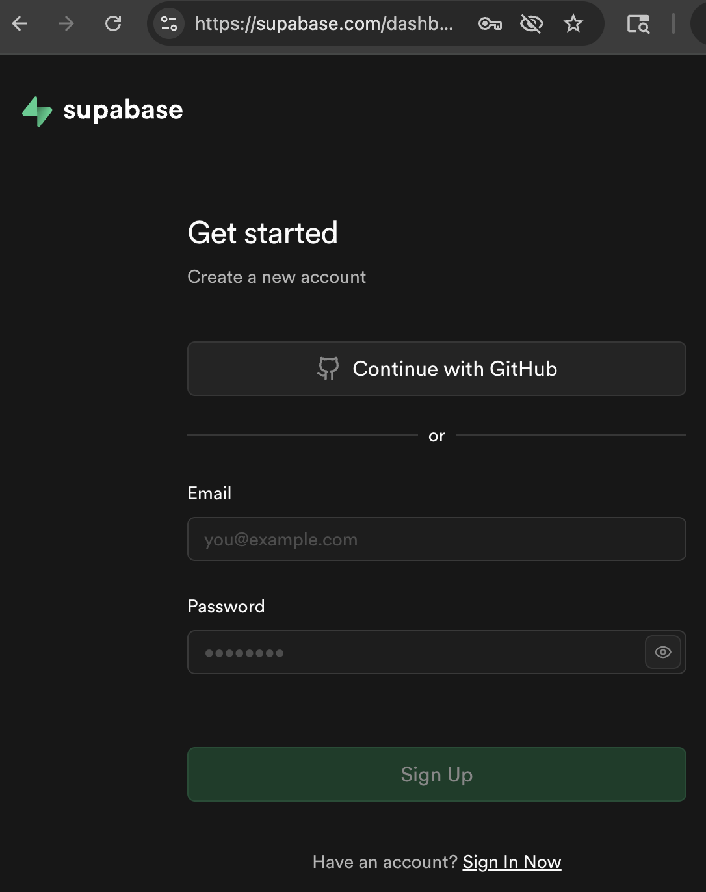
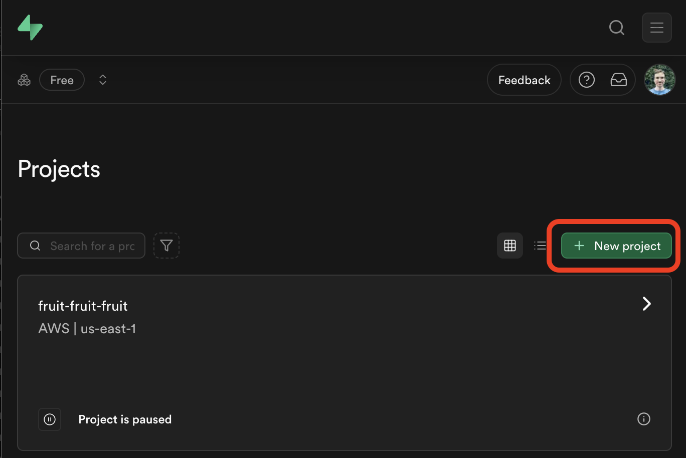
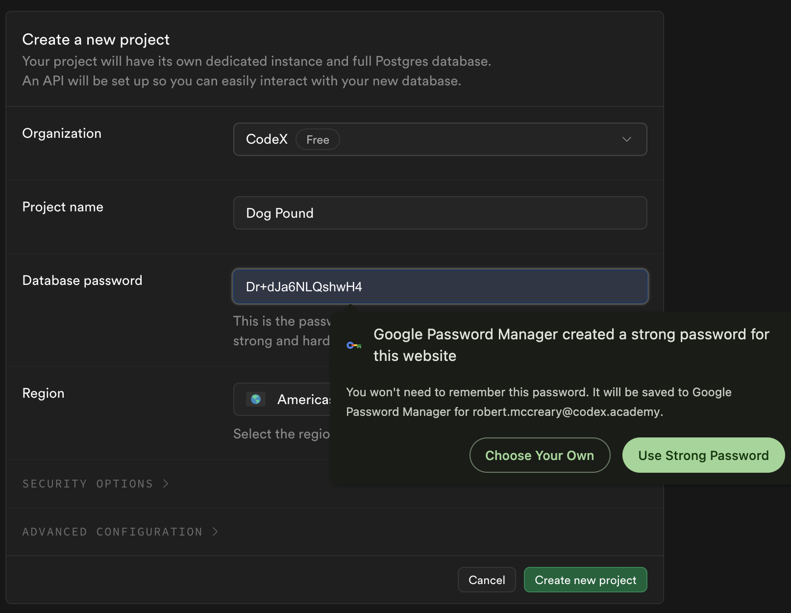
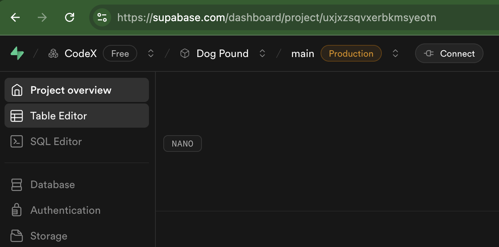
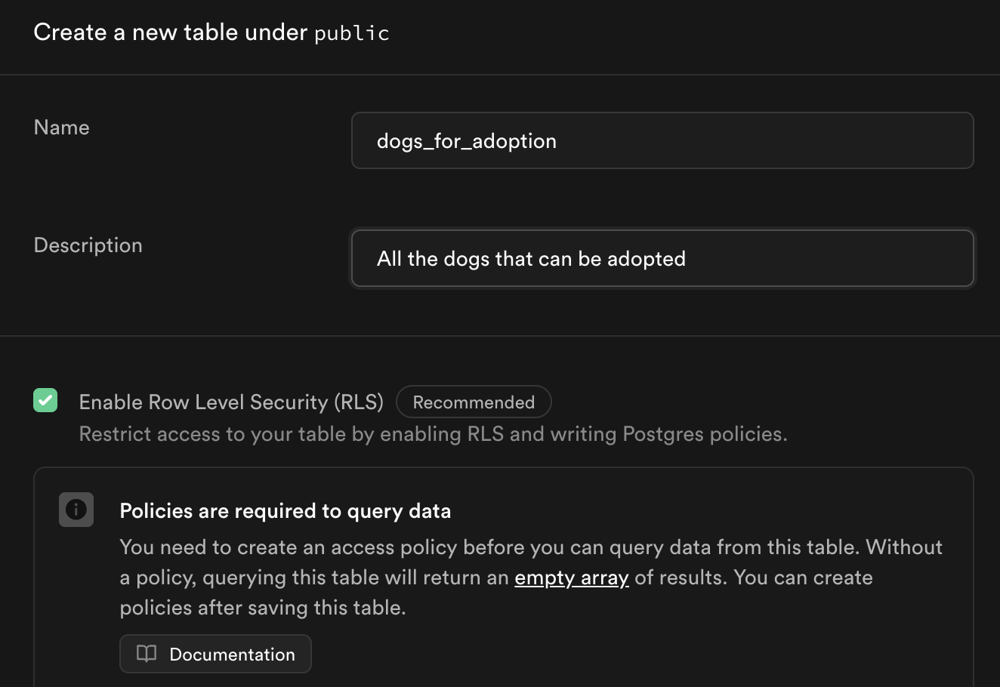
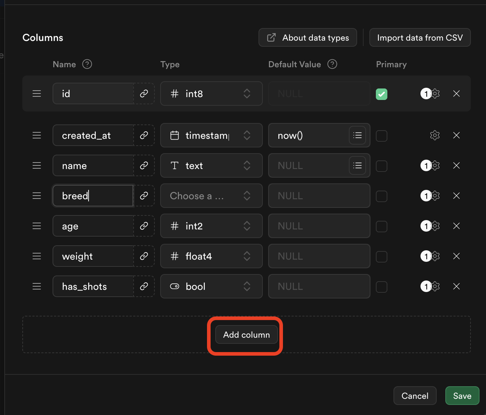
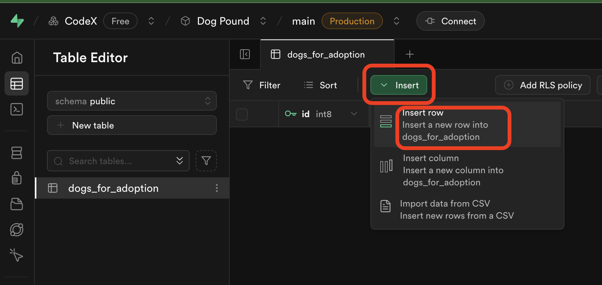
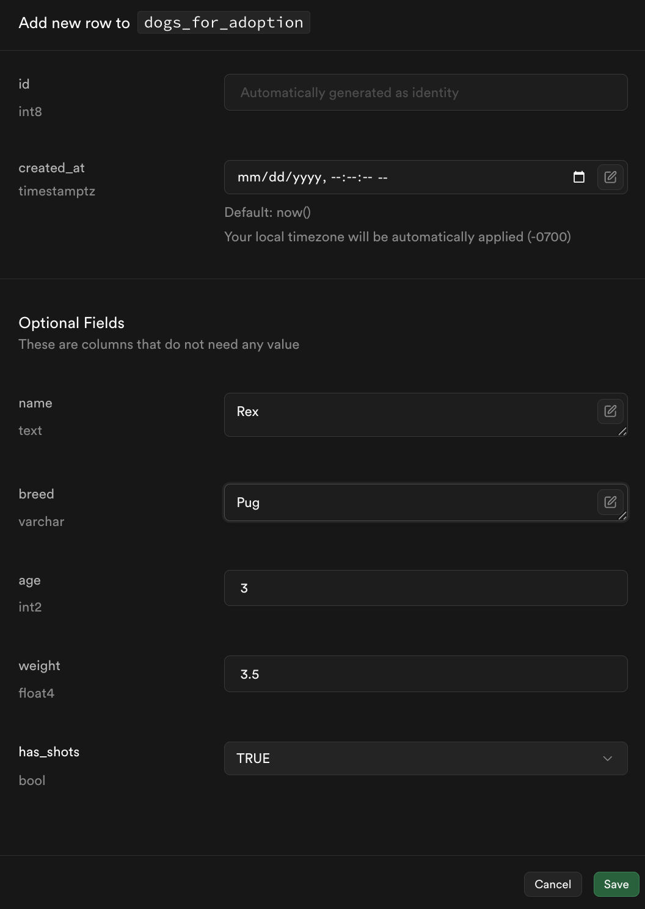
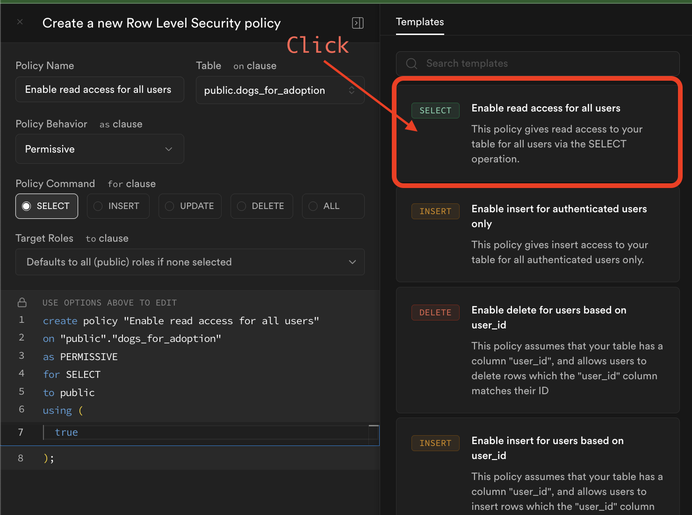
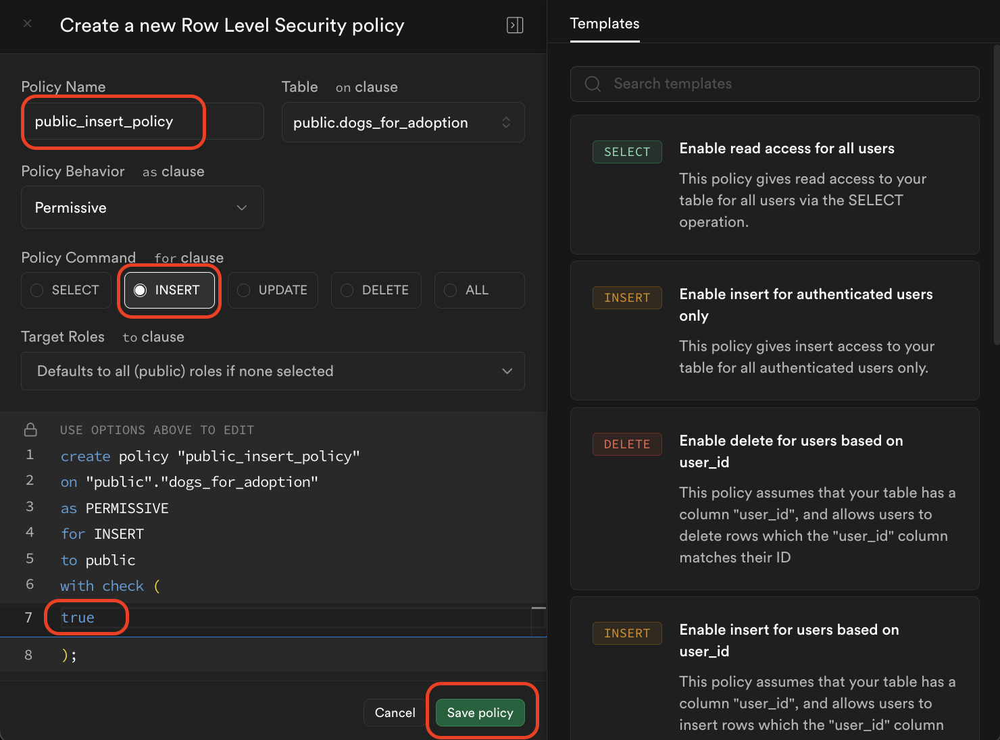

# Supabase Database Setup Guide

Learn how to set up a cloud database for your React applications using Supabase - a free, easy-to-use backend platform.

**What is Supabase?** An open-source Firebase alternative that provides a PostgreSQL database, authentication, storage, and real-time subscriptions.

---

## Why Use Supabase?

- ✅ **Free tier** - Perfect for learning and small projects
- ✅ **Real database** - PostgreSQL (professional-grade)
- ✅ **Easy to use** - Simple web interface and JavaScript client
- ✅ **No backend required** - Connect directly from React
- ✅ **Real-time updates** - Data syncs automatically

---

## Prerequisites

Before you begin:
- [ ] Email address for account creation
- [ ] Basic understanding of tables and rows
- [ ] React project ready (optional, for later connection)

**Time Required:** 15-20 minutes

---

## Step 1: Create Your Supabase Account

Go to [supabase.com](https://supabase.com) and create a free account.

Show Me

**💡 Tip:** Use your school or personal email. You'll need to verify your email address.

---

## Step 2: Create a New Project

After logging in, click "New Project" to start.

Show Me

**What to enter:**
- **Project Name:** Choose a descriptive name (e.g., "my-todo-app")
- **Database Password:** Create a strong password and **save it somewhere safe!**
- **Region:** Choose the closest region to you for best performance

---

## Step 3: Set Up Your Database

Wait for your project to finish setting up (this takes 1-2 minutes). You'll see a loading screen while Supabase creates your database.

Show Me

⚠️ **Important:** Save your database password! You'll need it to connect from your app.

**What's happening:** Supabase is creating a PostgreSQL database, setting up authentication, and configuring your project.

---

## Step 4: Navigate to the Table Editor

Once your project is ready, click on the **Table Editor** icon in the left sidebar.

Show Me

**What is the Table Editor?** A visual interface for creating and managing database tables - think of it like a spreadsheet for your data.

---

## Step 5: Create Your First Table

Click **"New Table"** to create a table for your data.

Show Me

**What to enter:**
- **Table Name:** Use a descriptive name (e.g., "todos", "products", "students")
- **Enable Row Level Security (RLS):** ✅ Keep this checked (we'll set up policies next)
- **Enable Realtime:** Optional - check if you want live updates

**💡 Naming Tips:**
- Use lowercase
- Use plural names (todos, not todo)
- No spaces (use underscores: `user_profiles`)

---

## Step 6: Add Columns to Your Table

Define what information each row will store by adding columns.

Show Me

**Example for a Todo List App:**

| Column Name | Type | Options |
|-------------|------|---------|
| id | int8 | Primary key, auto-increment (created automatically) |
| created_at | timestamptz | Default: now() (created automatically) |
| task | text | Required |
| completed | bool | Default: false |
| priority | text | Optional |

**Common Column Types:**
- **text** - For strings (names, descriptions)
- **int8** - For whole numbers
- **bool** - For true/false values
- **timestamptz** - For dates/times
- **numeric** - For decimal numbers

**💡 Tip:** The `id` and `created_at` columns are added automatically - you usually don't need to change these!

---

## Step 7: Insert Your First Row (Part 1)

Click **"Insert"** → **"Insert row"** to add data to your table.

Show Me

---

## Step 8: Enter Row Data (Part 2)

Fill in the values for your new row.

Show Me

**Example for Todo List:**
- **task:** "Learn Supabase"
- **completed:** false
- **priority:** "high"

**Note:** You don't need to fill in `id` or `created_at` - these are auto-generated!

Click **"Save"** when done.

---

## Step 9: Add More Data

Add at least **3 rows** of data to your table. This will help you test your app later!

**💡 Practice Tip:** Add diverse data to test different scenarios:
- Mix of completed and incomplete todos
- Different priority levels
- Variety of task types

---

## Step 10: Set Up Read Policy (Allow Public Read Access)

To let your React app read data, you need to set up security policies.

Click on **"RLS"** (Row Level Security) or **"Policies"** tab, then click **"New Policy"**.

Show Me

**Select the first template** on the left: **"Enable read access for all users"**

This allows anyone to **read** your data (perfect for demo apps and learning projects).

**When to use this:**
- Learning projects and demos
- Public data that anyone can view
- Apps without user accounts

⚠️ **Security Note:** For production apps with private data, you'll want more restrictive policies!

---

## Step 11: Set Up Write Policy (Allow Public Write Access)

To let your React app create new data, add another policy.

Click **"New Policy"** again.

Show Me

**Steps:**
1. Give it a policy name (e.g., "Enable insert for all users")
2. Select **"INSERT"** operation
3. Add `true` to the **"with check"** statement in the policy
4. Click **"Save"**

This allows anyone to **create** new rows in your table.

⚠️ **Security Warning:** Only use this for demo apps and learning! Real apps should authenticate users first.

---

## ✅ You're All Set!

Your Supabase database is now ready to connect to your React app!

**What you have:**
- ✅ Supabase account
- ✅ Project created with database
- ✅ Table with columns defined
- ✅ Sample data inserted (at least 3 rows)
- ✅ Read policy enabled (SELECT)
- ✅ Write policy enabled (INSERT)

---

## Next Steps

### Connecting to React

You'll need:
1. **Project URL** - Found in Project Settings → API
2. **Anon (public) key** - Found in Project Settings → API → Project API keys

Stay tuned for the React integration guide!

**Coming Next:**
- Installing Supabase client in React
- Fetching data from your table
- Creating new records from forms
- Real-time updates

---

## 🆘 Troubleshooting

### Issue: Can't see my data in the app
**Solution:** 
- Check that RLS policies are enabled (Step 10-11)
- Verify you're using the correct table name
- Check your API keys are correct

### Issue: Can't insert data
**Solution:**
- Make sure you have an INSERT policy (Step 11)
- Check required fields are filled
- Verify column types match your data

### Issue: Forgot my database password
**Solution:**
- Go to Project Settings → Database
- Click "Reset database password"
- Generate a new password and save it!

---

## 📚 Resources

**Official Documentation:**
- [Supabase Documentation](https://supabase.com/docs)
- [JavaScript Client Library](https://supabase.com/docs/reference/javascript/introduction)
- [Row Level Security Guide](https://supabase.com/docs/guides/auth/row-level-security)

**Video Tutorials:**
- [Supabase Crash Course](https://www.youtube.com/watch?v=7uKQBl9uZ00)
- [React + Supabase Tutorial](https://www.youtube.com/watch?v=lQ5iIxaYduI)

---

## 🎯 Quick Reference

**Supabase Dashboard Sections:**
- **Table Editor** - View and edit your data
- **SQL Editor** - Write custom queries
- **API Docs** - Auto-generated API documentation
- **Project Settings** - Get your API keys and URLs

**Common Terms:**
- **Table** - Like a spreadsheet (e.g., todos, users)
- **Row** - One entry in your table
- **Column** - A field/property (e.g., task, completed)
- **RLS** - Row Level Security (controls who can access data)
- **Policy** - Security rule for your table

---

**Congratulations!** You've set up your first cloud database. You're ready to build data-driven applications! 🚀

---

**Attribution:** This guide was created with assistance from Claude AI (Anthropic) to provide clear, step-by-step instructions for setting up Supabase.

